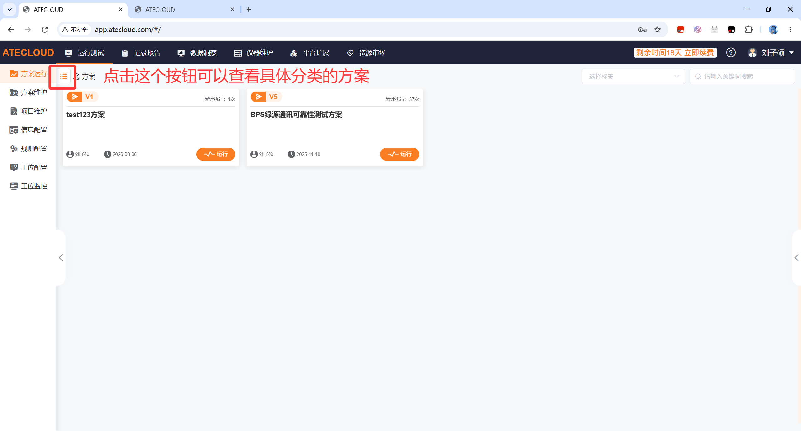
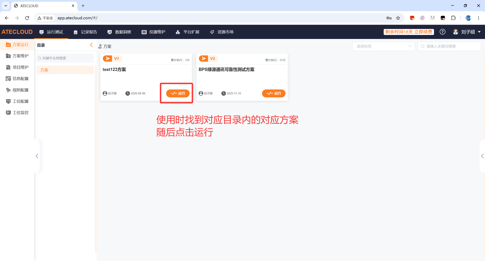
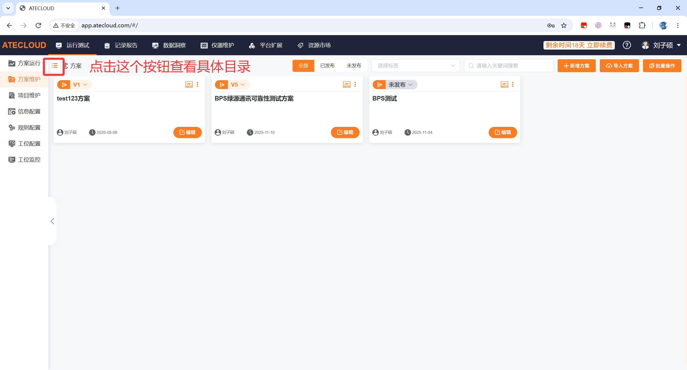
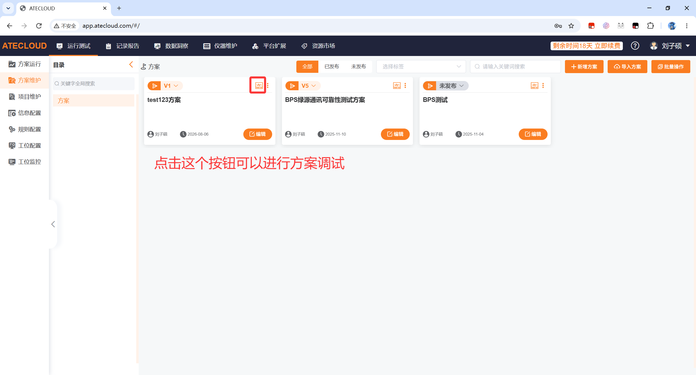
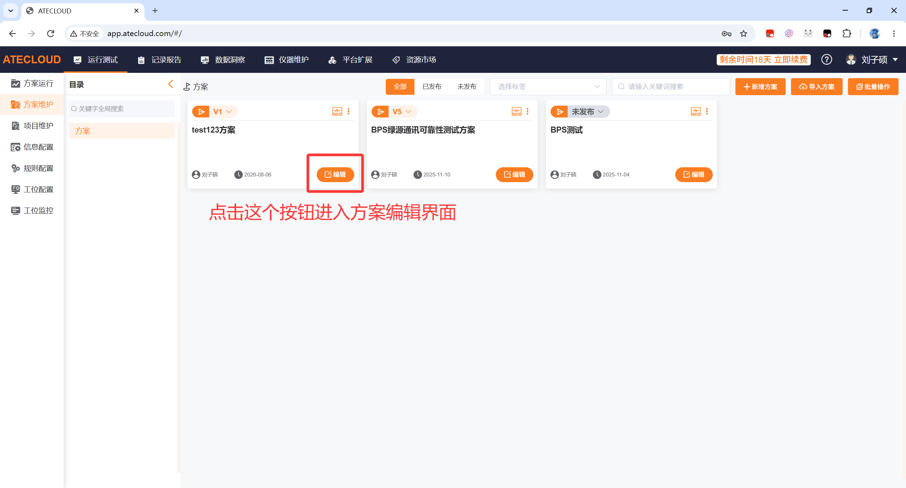
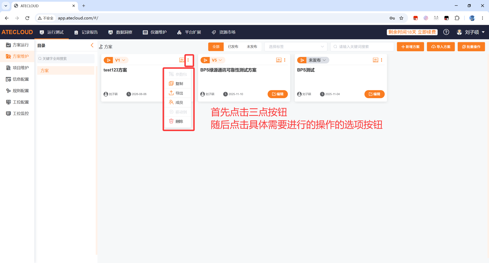
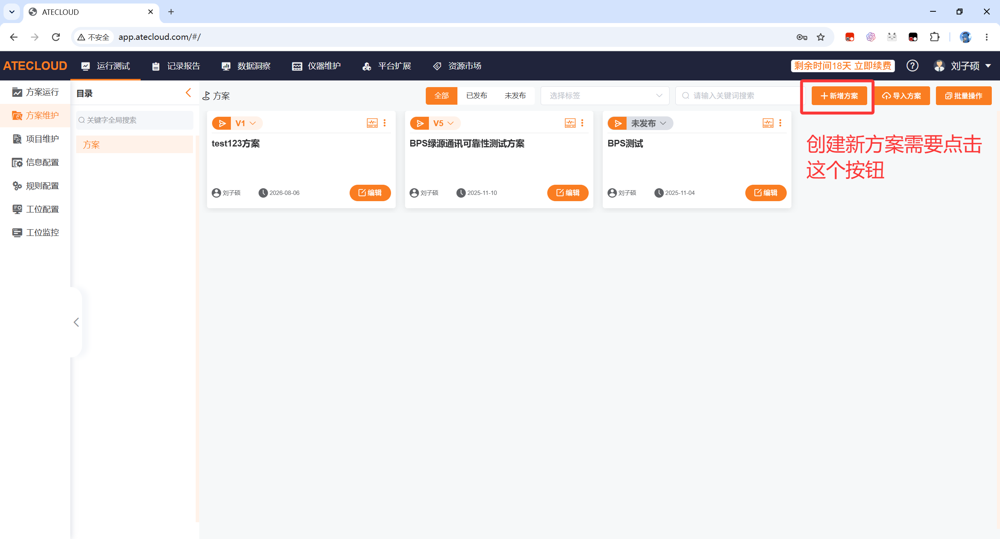
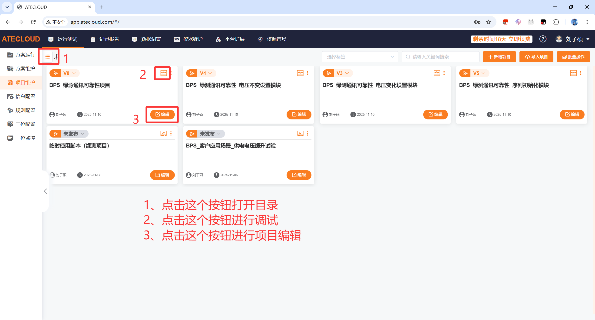
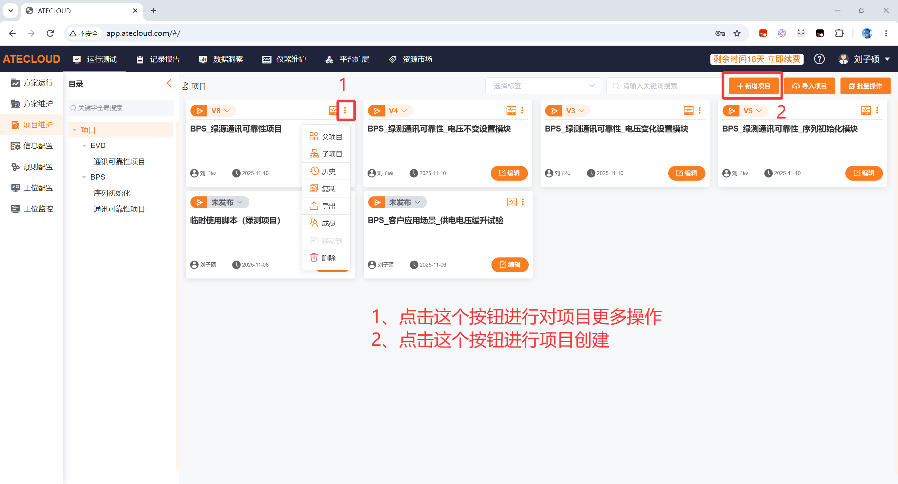
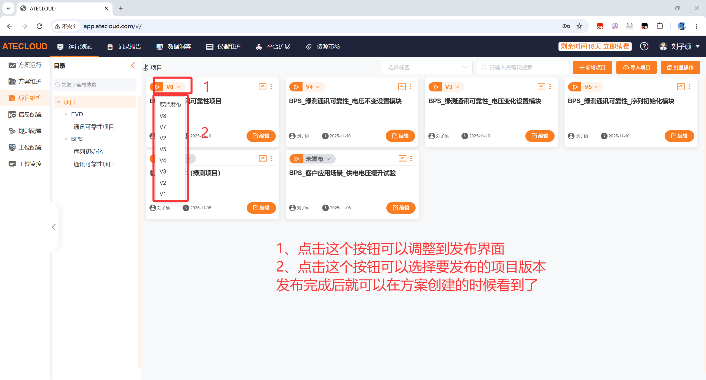

# 一、认识ATE平台

## 1.1、ATE简介

随着公司产品线的不断拓展和对产品质量要求的逐步提高，引入自动化测试已经成为公司的重点战略之一。而使用传统串口助手和Labview等软件无法简便做到自动测试、保存数据、生成报告的功能。而ATE系统很好的解决了自动测试、保存数据、生成报告的功能。

整个系统的构成分为ATE服务器、ATEBOX、测量设备、被测仪器。

它们之间的关系为：用户通过浏览器将方案和项目保存到ATE服务器，并在网页控制ATE服务器下发具体测试流程到ATEBOX，随后ATEBOX通过网口、串口等方式控制测量设备和被测仪器，并将测试数据保存至ATE服务器。最终用户通过网页导出ATE服务器保存的测试数据，完成整套测试流程。

【图片1:ATE系统示意图】

## 1.2、ATE登录界面

使用ATE系统的时候，我们需要登录才能进行后续方案、项目的搭建和运行。

- ATE系统的登陆地址为http://10.10.10.4:8141/#/login直接在浏览器中输入即可登录

- 登录需要使用密码登录，输入你的账户和密码即可进入

- 新员工如需使用ATE系统，需要先找刘子硕或李瑞香开通账号密码
- 如果忘记密码也需要寻找刘子硕或李瑞香

首次登录成功ATE系统会要求你更改密码，请一定要记住密码

【图片2:ATE登录界面】

## 1.3、运行测试界面

### 1.3.1、方案运行界面

方案运行界面显示的是已经搭建完成，可以立即执行的方案，如果您仅是使用平台而不开发，请在此界面选择具体测试方案，并点击运行

新版本添加了目录功能，点击这个按钮既可看到对应的方案目录

【图片3:方案目录界面】

【图片4:方案使用】

### 1.3.2、方案维护界面

方案维护界面显示的主要是正在搭建或已经完成的方案，在这个界面的主要工作是修改或者发布具体的方案，将编写好的方案进行整合。可以在这个页面进行方案调试。

同样的，点击目录按钮可以查看对应的方案目录

【图片5:方案目录界面】

寻找到你需要测试的方案后，点击这个按钮可以对方案进行调试测试

【图片6:方案调试使用】

点击这个按钮可以进行方案的具体编辑

【图片7方案调试使用】

除了编辑和调试，还有很多其他功能例如参数包、导出、方案权限管理等都隐藏在子菜单当中，需要点击三点按钮进行查看使用

【图片8方案调试额外功能使用】

在右上角有创建方案按钮，如果需要新增方案，需要点击这个按钮

【图片9方案创建功能使用】

### 1.3.3、项目维护界面

项目维护界面显示的主要是实际的自动化测试工作流程，在这个界面主要进行的工作是：编写自动化测试的流程，对编写的测试流程进行调试。

【图片10:项目维护界面】

【图片11:项目创建与更多选项界面】

如果项目编写完成，需要将其保存并让方案调用，那么点击这个按钮完成发布，每次发布一个新版本就保存一版，可以手动点击要发布的版本。

【图片12:项目发布界面】

### 1.3.4、工位配置界面

工位配置界面显示的主要是

【图片5:工位配置界面】

## 1.4、记录报告界面

### 1.4.1

### 1.4.2

### 1.4.3

## 1.5、仪器维护界面

### 1.5.1

### 1.5.2

### 1.5.3

## 1.6、平台拓展界面

### 1.6.1

### 1.6.2

### 1.6.3

## 1.7、资源市场（新功能）

# 二、项目搭建

# 三、方案搭建

## 3.1、新建方案

## 3.2、方案参数包

# 四、运行测试

## 4.1、测试前工位检查

## 4.2、测试选择参数包

# 五、报告模板

# 六、导出报告