# ATE平台使用教程

> 本文档为 ATE 自动化测试平台的使用教程，建议按章节顺序阅读。

## 文档定位与阅读建议

| 你的角色 | 建议重点阅读 | 读完后能做到 |
| --- | --- | --- |
| 测试操作新人 | 第一章、第四～六章 | 会登录、会检查工位、会跑测试、会导出报告 |
| 方案 / 模板搭建人员 | 第一章～第三章、第五章 | 会建项目、会搭方案、会做导出模板 |
| 仪器 / 算法维护人员 | 第一章、第二～三章、第七～八章 | 会录入仪器、维护解析器与算法 |

新人不必一次记住所有功能。建议先按“**认识平台 → 搭建项目 → 搭建方案 → 运行测试 → 制作模板 → 导出报告**”的顺序建立整体印象，再回头查看具体按钮。

### 按角色看：完整操作流程

下面按“测试操作新人”“方案 / 模板搭建人员”“仪器 / 算法维护人员”三类角色，分别给出完整操作流程。

#### 测试操作新人：运行方案并导出报告

**适用人群**：只使用别人搭好的方案做测试，不负责方案开发和仪器维护。

**阶段顺序**：测试前准备 → 选择方案并进入运行界面 → 配置并启动测试 → 查看结果并导出报告。

> 阅读方式：**阶段从上到下**排列，**每个阶段内部的步骤从左到右**排列。

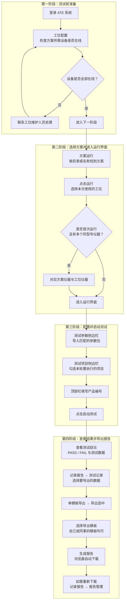
```mermaid
flowchart TD
    subgraph S1["第一阶段：测试前准备"]
        direction LR
        A1["登录 ATE 系统"] --> A2["工位配置<br/>检查方案所需设备是否在线"]
        A2 --> A3{"设备是否全部在线？"}
        A3 -->|否| A4["联系工位维护人员处理"]
        A4 --> A2
        A3 -->|是| A5["进入下一阶段"]
    end

    subgraph S2["第二阶段：选择方案并进入运行界面"]
        direction LR
        B1["方案运行<br/>按目录或名称找到方案"] --> B2["点击运行<br/>选择本次使用的工位"]
        B2 --> B3{"是否首次运行<br/>且有多个同型号仪器？"}
        B3 -->|是| B4["对应方案仪器与工位仪器"]
        B3 -->|否| B5["进入运行界面"]
        B4 --> B5
    end

    subgraph S3["第三阶段：配置并启动测试"]
        direction LR
        C1["测试参数侧边栏<br/>导入匹配的参数包"] --> C2["测试项目侧边栏<br/>勾选本轮要执行的项目"]
        C2 --> C3["顶部栏填写产品编号"]
        C3 --> C4["点击启动测试"]
    end

    subgraph S4["第四阶段：查看结果并导出报告"]
        direction LR
        D1["查看测试结论<br/>PASS / FAIL 与测试数据"] --> D2["记录报告 → 测试记录<br/>选择要导出的数据"]
        D2 --> D3["单模板导出 → 导出选中"]
        D3 --> D4["选择导出模板<br/>自己或同事的模板均可"]
        D4 --> D5["生成报告<br/>浏览器自动下载"]
        D5 --> D6["如需重新下载<br/>记录报告 → 报告管理"]
    end

    A5 --> B1
    B5 --> C1
    C4 --> D1
```

**关键页面与按钮**：工位配置、方案运行、运行、启动测试、记录报告、测试记录、单模板导出、导出选中、生成报告。

**对应章节**：第一章 1.9 节（快速上手）、第四章（运行测试）、第五章（报告模板）、第六章（导出报告）。

#### 方案 / 模板搭建人员：搭建项目、方案与导出模板

**适用人群**：负责把测试流程做成项目、把项目组合成方案，并为方案制作导出模板。

**阶段顺序**：搭建并发布项目 → 搭建并发布方案 → 制作导出模板。

> 阅读方式：**阶段从上到下**排列，**每个阶段内部的步骤从左到右**排列。

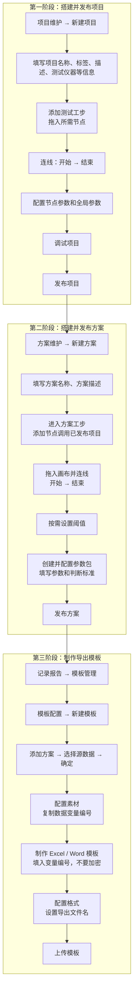
```mermaid
flowchart TD
    subgraph P1["第一阶段：搭建并发布项目"]
        direction LR
        A1["项目维护 → 新建项目"] --> A2["填写项目名称、标签、描述、测试仪器等信息"]
        A2 --> A3["添加测试工步<br/>拖入所需节点"]
        A3 --> A4["连线：开始 → 结束"]
        A4 --> A5["配置节点参数和全局参数"]
        A5 --> A6["调试项目"]
        A6 --> A7["发布项目"]
    end

    subgraph P2["第二阶段：搭建并发布方案"]
        direction LR
        B1["方案维护 → 新建方案"] --> B2["填写方案名称、方案描述"]
        B2 --> B3["进入方案工步<br/>添加节点调用已发布项目"]
        B3 --> B4["拖入画布并连线<br/>开始 → 结束"]
        B4 --> B5["按需设置阈值"]
        B5 --> B6["创建并配置参数包<br/>填写参数和判断标准"]
        B6 --> B7["发布方案"]
    end

    subgraph P3["第三阶段：制作导出模板"]
        direction LR
        C1["记录报告 → 模板管理"] --> C2["模板配置 → 新建模板"]
        C2 --> C3["添加方案 → 选择源数据 → 确定"]
        C3 --> C4["配置素材<br/>复制数据变量编号"]
        C4 --> C5["制作 Excel / Word 模板<br/>填入变量编号，不要加密"]
        C5 --> C6["配置格式<br/>设置导出文件名"]
        C6 --> C7["上传模板"]
    end

    A7 --> B1
    B7 --> C1
```

**关键页面与按钮**：项目维护、新建项目、添加测试工步、添加节点、发布；方案维护、新建方案、方案工步、参数包、发布；模板管理、模板配置、添加方案、配置素材、配置格式、上传模板。

**对应章节**：第二章（项目搭建）、第三章（方案搭建）、第五章（报告模板）。

#### 仪器 / 算法维护人员：录入仪器、解析器与算法

**适用人群**：负责把新仪器接入系统、录入控制命令，并维护解析器和自定义算法。

**阶段顺序**：录入仪器类型与型号 → 录入指令 → 编写解析器 → 绑定并调试解析器 → 编写并发布算法。

> 阅读方式：**阶段从上到下**排列，**每个阶段内部的步骤从左到右**排列。如果设备使用 SCPI 协议，可以跳过“编写解析器”和“绑定并调试解析器”两个阶段。

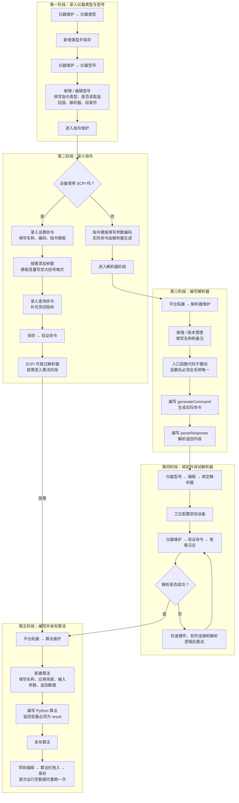
```mermaid
flowchart TD
    subgraph S1["第一阶段：录入仪器类型与型号"]
        direction LR
        A1["仪器维护 → 仪器类型"] --> A2["新增类型并保存"]
        A2 --> A3["仪器维护 → 仪器型号"]
        A3 --> A4["新增 / 编辑型号<br/>填写指令类型、是否读取返回值、解析器、结束符"]
        A4 --> A5["进入指令维护"]
    end

    subgraph S2["第二阶段：录入指令"]
        direction LR
        B1{"设备使用 SCPI 吗？"}
        B1 -->|是| B2["录入设置命令<br/>填写名称、编码、指令模板"]
        B2 --> B3["按需添加参数<br/>模板变量写双大括号格式"]
        B3 --> B4["录入查询命令<br/>补充测试指标"]
        B4 --> B5["保存 → 验证命令"]
        B5 --> B6["SCPI 可跳过解析器<br/>按需进入算法阶段"]
        B1 -->|否| B7["指令模板填写参数编码<br/>实际命令由解析器生成"]
        B7 --> B8["进入解析器阶段"]
    end

    subgraph S3["第三阶段：编写解析器"]
        direction LR
        C1["平台拓展 → 解析器维护"] --> C2["新增 / 版本管理<br/>填写名称和备注"]
        C2 --> C3["入口函数代码不要动<br/>函数名必须全系统唯一"]
        C3 --> C4["编写 generateCommand<br/>生成实际命令"]
        C4 --> C5["编写 parseResponse<br/>解析返回内容"]
    end

    subgraph S4["第四阶段：绑定并调试解析器"]
        direction LR
        D1["仪器型号 → 编辑 → 绑定解析器"] --> D2["工位配置添加设备"]
        D2 --> D3["仪器维护 → 验证命令 → 查看日志"]
        D3 --> D4{"解析是否成功？"}
        D4 -->|否| D5["检查硬件、软件连接和解析逻辑后重试"]
        D5 --> D3
    end

    subgraph S5["第五阶段：编写并发布算法"]
        direction LR
        E1["平台拓展 → 算法维护"] --> E2["新建算法<br/>填写名称、应用场景、输入参数、返回数据"]
        E2 --> E3["编写 Python 算法<br/>返回变量必须为 result"]
        E3 --> E4["发布算法"]
        E4 --> E5["项目编辑 → 算法栏拖入 → 保存<br/>首次运行空数据可重跑一次"]
    end

    A5 --> B1
    B8 --> C1
    C5 --> D1
    D4 -->|是| E1
    B6 -->|按需| E1
```

**关键页面与按钮**：仪器维护、仪器类型、仪器型号、指令维护、保存、验证；平台拓展、解析器维护、算法维护；工位配置。

**对应章节**：第七章（仪器录入与命令修改）、第八章（解析器与算法维护）。

> **补充说明**：如果设备使用 SCPI 协议，可以跳过解析器部分；算法属于按需编写，不是每台仪器都必须使用。

# 一、认识ATE平台（新人入门篇）

> **写给新人**：本章不需要你记住所有按钮，先看懂三件事就够了——ATE 是什么、如何登录、日常测试入口在哪里。具体操作会在后面的章节逐步展开。

## 本章你将了解

- ATE 是什么，能解决什么问题
- 使用 ATE 能带来哪些好处
- ATE 系统由哪些部分组成
- 如何登录 ATE 系统
- 登录后各主要界面是做什么的
- 新人日常测试的完整流程

## 1.1、ATE是什么？

ATE（Automatic Test Equipment，自动化测试设备）是一套用于自动完成产品测试、数据保存和报告生成的系统。

用一句话理解：**你只需要提前把“怎么测”配置好，ATE 就会自动控制仪器完成测试，并把数据完整地保存下来。**

举个例子：以前测试一台电源的电压精度，需要人工接线、手动设置仪器、逐点读数，再把数据抄进表格；使用 ATE 后，这些步骤被编写成“项目 + 方案”，点击运行即可自动完成，测试数据也会自动入库。

### 1.1.1、ATE 系统由哪几部分组成

| 组成部分 | 作用 | 通俗理解 |
| --- | --- | --- |
| ATE 服务器 | 保存方案、项目、测试数据，负责整体调度 | 大脑和数据中心 |
| ATEBOX | 接收服务器下发的测试流程，控制测量设备和被测仪器 | 现场执行的“手和脚” |
| 测量设备 | 执行具体测量的仪器，如万用表、示波器等 | 用来测量的工具 |
| 被测仪器 | 需要被测试的产品或设备 | 被检测的对象 |

### 1.1.2、ATE 是怎么工作的

它们的工作流程可以简单理解为：

1. 用户在网页上配置好测试方案和项目；
2. ATE 服务器把测试流程下发给 ATEBOX；
3. ATEBOX 控制测量设备和被测仪器执行测试；
4. 测试数据回传到 ATE 服务器保存；
5. 用户在网页上导出测试数据和报告。

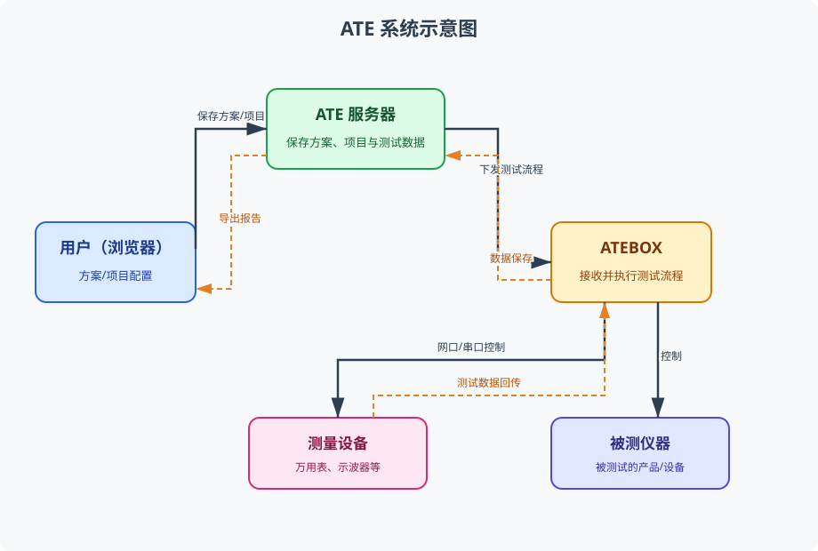

【图片1:ATE系统示意图】

## 1.2、使用ATE有什么好处？

新人先不用记功能，但要理解 ATE 解决的核心问题：**把重复、易出错、需要留痕的测试工作自动化。**

| 传统测试方式 | 使用 ATE 后 |
| --- | --- |
| 手动操作仪器，逐条抄录数据 | 流程自动运行，数据自动采集 |
| 结果分散在个人电脑或表格里，难以追溯 | 测试记录统一保存在服务器，可查询、可留痕 |
| 更换型号或参数时要重新设置 | 通过参数包快速切换参数和判断标准 |
| 报告靠人工整理 | 按模板一键生成并导出报告 |
| 多台仪器只能依次读取 | 支持并行控制，多台设备同时读取（新功能） |
| 仪器命令反复录入 | 资源市场可直接引用已有命令，减少重复劳动 |

也可以概括为四个好处：

1. **更省事**：流程搭一次，后续重复调用；
2. **更准确**：减少人工抄录和误操作；
3. **更规范**：测试数据、版本和报告都有记录、可追溯；
4. **更高效**：支持批量与并行测试，报告一键导出。

## 1.3、登录ATE系统

ATE 系统通过浏览器登录后使用。登录成功后，才能进行方案搭建、项目开发和测试运行。

| 项目 | 说明 |
| --- | --- |
| 登录地址 | http://10.10.10.4:8141/#/login |
| 账号 | 管理员为你开通的账号 |
| 密码 | 管理员为你设置的初始密码 |
| 开通账号 / 忘记密码 | 联系刘子硕或李瑞香 |

登录步骤：

1. 打开浏览器，在地址栏输入登录地址并回车；
2. 输入账号和密码；
3. 点击登录，进入系统首页。

> **新人提示**：首次登录成功后，系统会要求修改初始密码，请务必牢记修改后的密码。如果忘记密码，请联系刘子硕或李瑞香重置。


【图片2:ATE登录界面】

## 1.4、登录后能做什么：主要界面速览

登录后，建议先找到下面这些入口。日常使用最频繁的是“方案运行”，其他界面可以先了解用途，用到时再查。

| 界面 | 主要用途 | 新人使用频率 |
| --- | --- | --- |
| 方案运行 | 运行已经搭建好的方案 | 经常使用 |
| 方案维护 | 新建、调试、编辑、发布方案 | 搭建方案时使用 |
| 项目维护 | 编写和维护自动化测试流程 | 修改流程时使用 |
| 工位配置 | 管理 ATEBOX、仪器、算法和解析器 | 按需使用 |
| 测试记录 | 查看、导出历史测试数据 | 测试后使用 |
| 模板管理 | 制作测试数据导出模板 | 定制报告时使用 |
| 报告管理 | 查看、下载已导出的报告 | 需要报告时使用 |
| 仪器维护 | 维护仪器类型和型号命令 | 维护人员使用 |
| 算法/解析器维护 | 扩展算法和私有协议解析 | 开发人员使用 |
| 资源市场 | 引用其他厂家的仪器命令 | 需要时使用 |

下面按区域分别介绍。

### 1.4.1、方案运行界面

> 这是日常使用频率最高的界面。如果只是执行测试，先掌握这里就够用了。

这个界面显示的是已经搭建完成、可以立即执行的方案。

**适合谁**：只使用平台进行测试、不负责开发方案的新人。

**怎么用**：

1. 进入“方案运行”界面；
2. 找到需要执行的方案（新版本支持“目录”功能，可点击“目录”按钮按目录快速查找）；
3. 点击“运行”，按提示选择工位后进入运行界面（详细操作见第四章）。


【图片3:方案目录界面】


【图片4:方案使用】

### 1.4.2、方案维护界面

这个界面主要显示正在搭建或已经完成的方案。方案开发人员可以在这里修改、发布和整合方案，也可以进行调试。

> **新人提示**：如果你只是执行测试，一般不需要进入这个界面。

点击“目录”按钮可以查看对应的方案目录。


【图片5:方案目录界面】

找到需要测试的方案后，常用操作如下：

- **调试**：点击“调试”按钮，即可对该方案进行调试；

  

  【图片6:方案调试使用】

- **编辑**：点击“编辑”按钮，可以进入方案编辑页面，修改方案的具体内容；

  

  【图片7:方案编辑使用】

- **更多功能**：除编辑和调试外，这里还提供参数包、导出、方案权限管理等功能，都在右上角的“三点”子菜单中；

  

  【图片8:方案调试额外功能使用】

- **新建方案**：如果需要新建方案，点击页面右上角 / 右侧的“新建方案”按钮（部分版本显示为“创建方案”）。

  

  【图片9:方案创建功能使用】

### 1.4.3、项目维护界面

这个界面主要用于编写和维护自动化测试流程。

简单理解：**方案决定“测什么”，项目决定“怎么测”。**


【图片10:项目维护界面】


【图片11:项目创建与更多选项界面】

项目编写完成后，需要点击“发布”按钮保存并发布。每次发布新版本都会保留一个版本记录，也可以手动选择要发布的版本。


【图片12:项目发布界面】

### 1.4.4、工位配置界面

这个界面显示公司目前所有的 ATEBOX。新版本支持成员管理，可以配置哪些成员可以使用哪个工位。

如果需要使用新工位或新 BOX，请联系李瑞香或刘子硕。

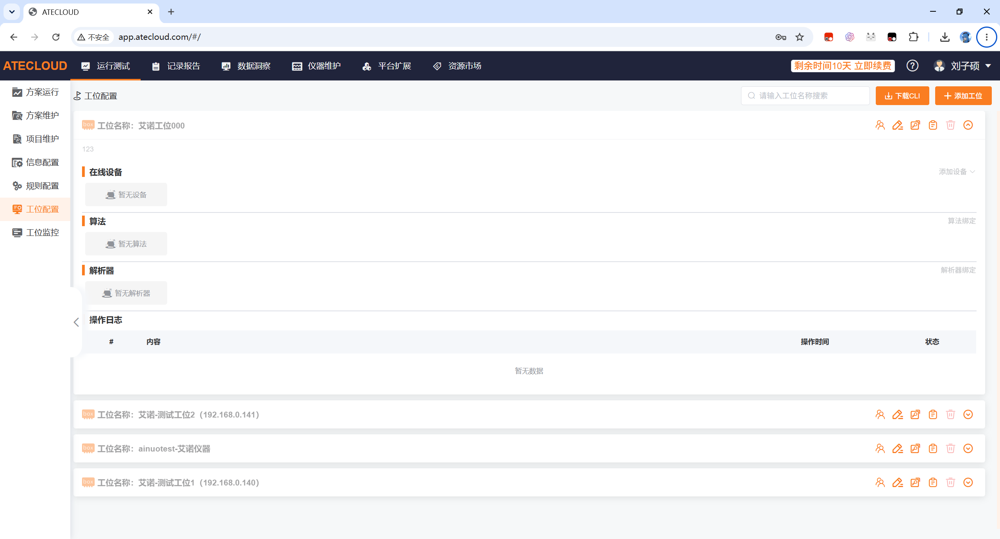

【图片13:工位配置界面】

测试工程师需要在这里添加自动化测试会用到的仪器、算法和解析器。点击如图按钮即可添加。

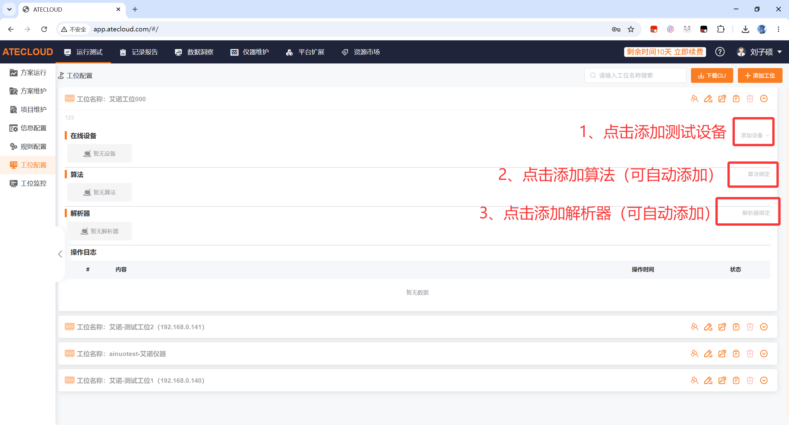

【图片14:工位设备添加】

如果测试中出现连接失败等问题，可以在这里查看日志，帮助定位问题。

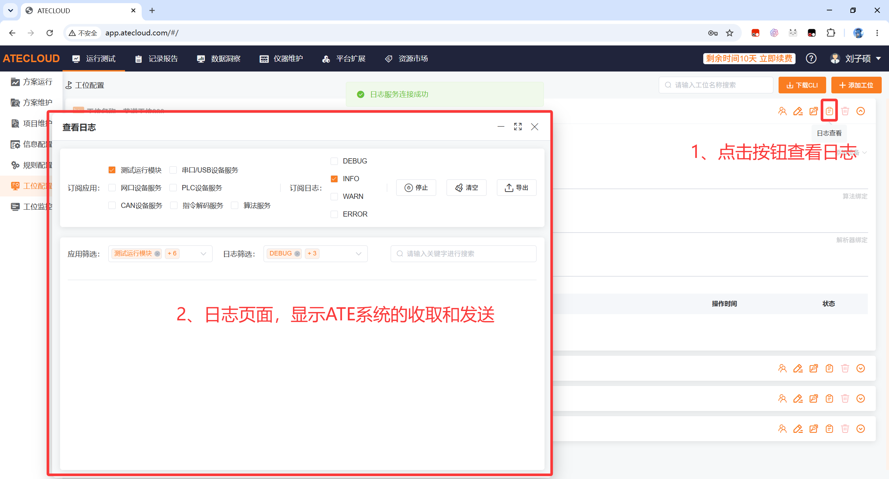

【图片15:工位页面日志查看】

## 1.5、记录与报告界面

> 测试完成后，数据查看、模板制作和报告下载都在这一区域。

### 1.5.1、测试记录界面

这里保存着所有已经完成的测试记录。通过该界面可以查看：

- 什么时间做的测试；
- 测试的是什么产品；
- 测试结果和数据是什么。

点击相应按钮即可查看详细测试数据。

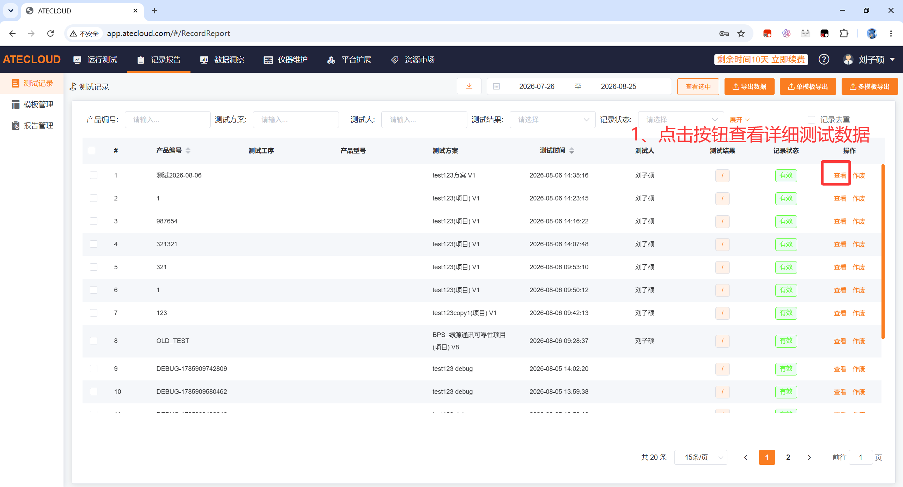

【图片16:测试记录界面查看】

如果需要把测试数据交给别人，可以在这里导出为表格、Word 等格式。如下图所示，点击相应按钮即可完成导出。

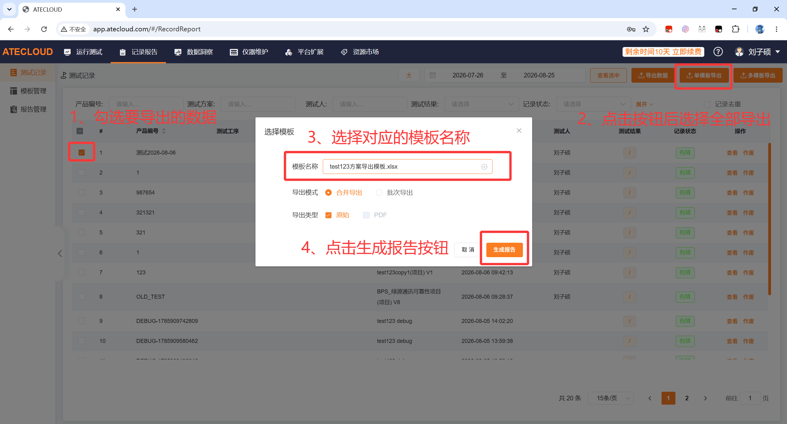

【图片17:测试记录导出界面】

> **提示**：这里导出的是原始测试数据；如果需要按固定格式生成正式报告，请先制作导出模板，再导出报告（见第五章、第六章）。

### 1.5.2、模板管理界面

这里用于管理测试数据导出模板。可以针对已经发布的方案制作和修改模板，决定导出报告的内容和样式。

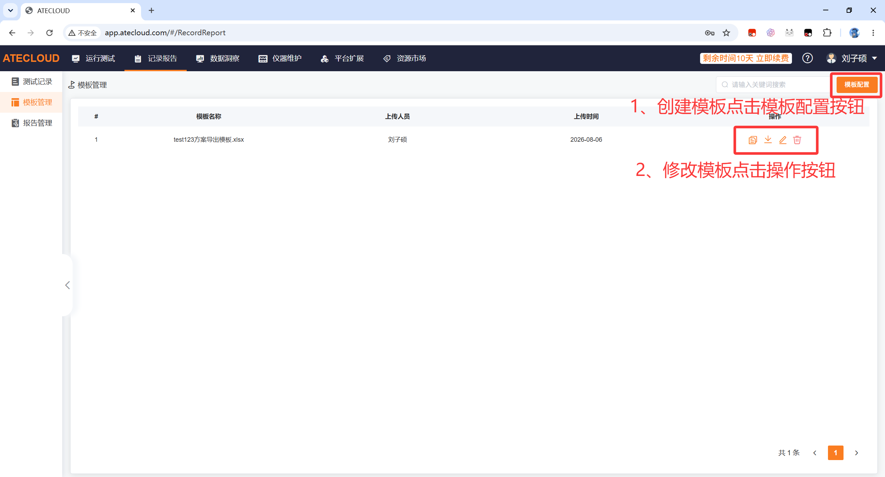

【图片18:模板管理界面】

### 1.5.3、报告管理界面

这里存放所有已经导出为文件的报告副本。可以查看导出后的实际效果，也可以重新下载报告文件。

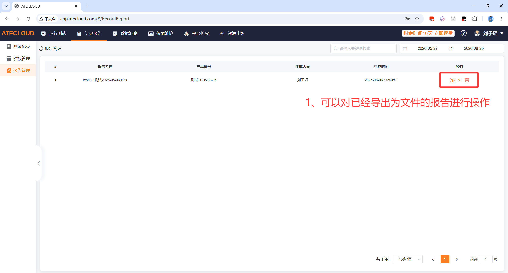

【图片19:报告管理界面】

## 1.6、仪器维护界面

> 通常由维护人员或管理员操作，新人先了解即可。

### 1.6.1、仪器类型界面

这里显示 ATE 系统中已有的设备类型，例如射频开关控制设备。如果公司新开发的产品在系统中没有对应的设备类型，就需要在这里新建仪器类型，并填写备注。

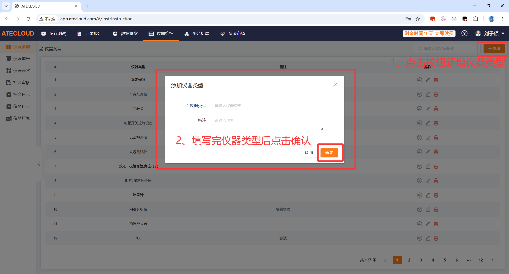

【图片20:仪器类型界面】

### 1.6.2、仪器型号界面

这里显示具体的设备信息，包括仪器型号、仪器类型、仪器厂家、标准指令、非标准指令等。可以在这里添加或修改具体仪器的命令。

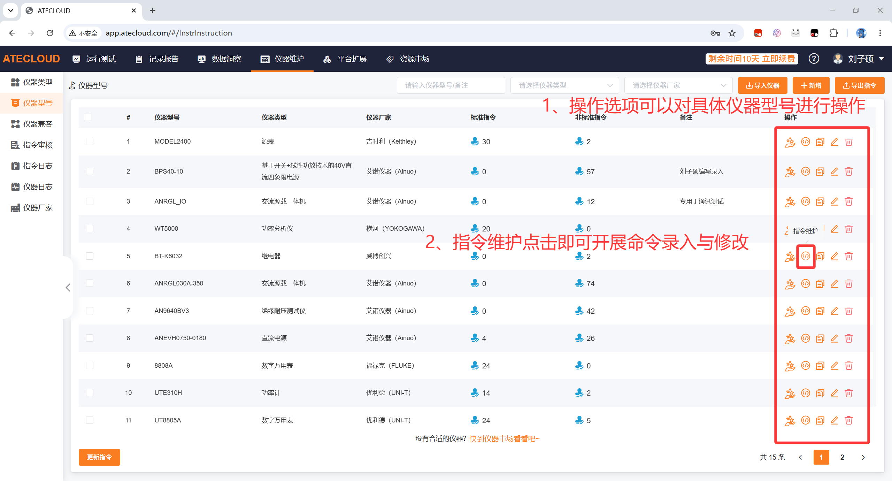

【图片21:仪器型号界面】

## 1.7、平台拓展界面

### 1.7.1、算法维护

当系统自带逻辑无法满足复杂测试需求时，可以通过 Python 算法实现特定功能。算法维护界面显示的是当前系统中个人编写的算法。

> **新人提示**：算法一般由开发人员维护，新人使用时直接调用即可。

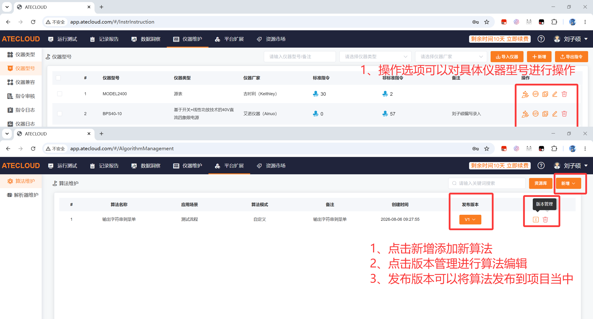

【图片22:算法维护界面】

### 1.7.2、解析器维护

大部分设备使用 SCPI 协议，但仍有部分设备使用私有协议（如 AN3.0）。解析器的作用相当于“翻译官”，把 ATE 系统发出的命令转换成设备能理解的私有协议命令。

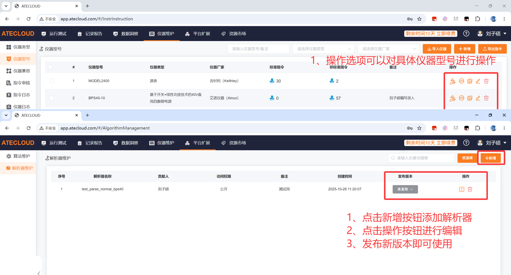

【图片23:解析器维护界面】

## 1.8、资源市场（新功能）

资源市场可以将其他厂家的设备仪器命令直接添加到本地库中，减少重复录入工作。

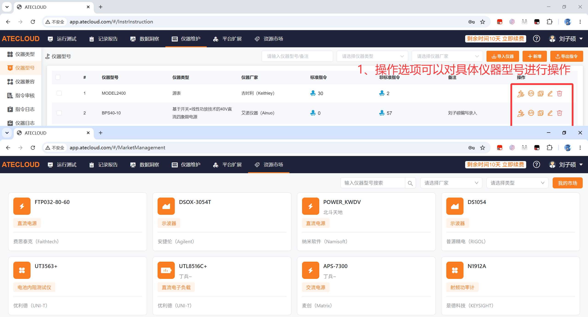

【图片24:资源市场界面】

## 1.9、新人快速上手：一次完整测试的五步

如果你只是使用别人搭好的方案做测试，可以按下面五步完成一次测试：

1. **登录系统**：用管理员开通的账号登录；
2. **检查工位**：进入“工位配置”，确认方案需要用到的设备都已在线；
3. **找到方案**：进入“方案运行”界面，按目录或名称找到对应方案；
4. **配置运行界面**：点击“运行”并选择工位，在运行界面导入参数包、勾选测试项目、填写产品编号；
5. **启动并查看**：点击“启动测试”，测试结束后到“测试记录”查看结果，需要时导出数据或报告。

### 遇到问题怎么办

| 问题 | 处理方式 |
| --- | --- |
| 没有账号、忘记密码 | 联系刘子硕或李瑞香开通或重置 |
| 找不到要用的方案 | 先确认方案是否已发布，或使用“目录”功能查找 |
| 运行时提示连接失败 | 到“工位配置”界面查看日志，并联系维护人员 |
| 不知道如何搭建项目或方案 | 继续阅读第二章、第三章 |
| 模板制作或导出报告遇到问题 | 查看第五章、第六章的“注意事项”和“常见问题” |

# 二、项目搭建

> 本章介绍如何新建项目、编辑项目流程、修改项目以及发布项目。建议先了解节点和连线的基本概念，再动手搭建。

## 本章导读：先理解三个概念

动手之前，先记住三个词，后面的操作就很好理解了：

| 概念 | 含义 | 通俗理解 |
| --- | --- | --- |
| 项目 | 一条完整的测试流程，规定“怎么测” | 一张菜谱 |
| 节点 | 流程中的每一步操作，例如发命令、等待、判断 | 菜谱里的一个步骤 |
| 连线 | 规定节点之间的先后顺序 | 步骤的先后关系 |

**一条可执行的项目流程必须满足两点：**

1. 从“开始”节点出发；
2. 最终连到“结束”节点。

搭建一个项目通常分为五步：

1. 新建项目，填写基础信息；
2. 添加节点，搭建测试流程；
3. 配置节点参数和全局参数；
4. 调试项目，确认流程可以跑通；
5. 发布项目，供方案调用。

下面按这个顺序展开。

## 2.1、新建项目

要进行自动化测试，需要先告诉 ATE 系统整个测试的工作流程，而**一个项目就是一条测试流程**。下面介绍如何新建项目。

新建项目的步骤：

1. 进入“项目维护”界面；
2. 点击“新建项目”；
3. 填写项目基础信息，例如项目名称、项目标签、项目描述、测试仪器、测试仪器标签等；
4. 保存后即可进入流程编辑。

> **命名建议**：项目名称建议写清楚“测什么产品 + 测哪一项”，例如“华为精度测试——电压精度测试”，方便后续在方案中查找和复用。

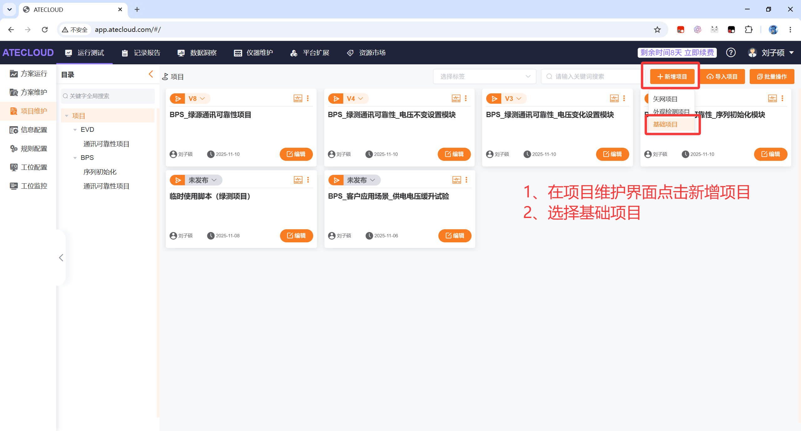

【图片25:新建项目界面】

点击“新建项目”后，在正式开始编写流程前，需要先填写项目基础信息。

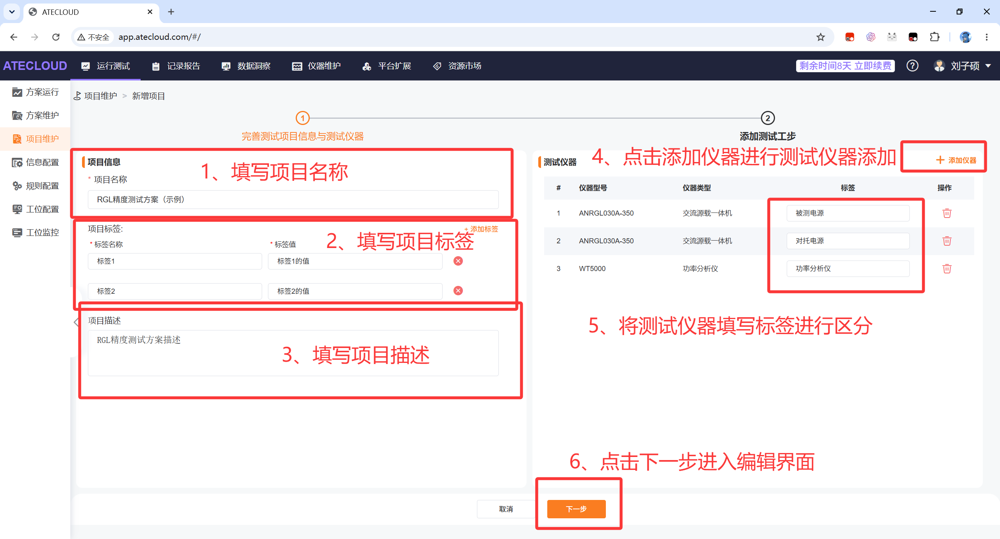

【图片26:新建项目界面】

## 2.2、编辑项目

完成项目基础信息填写后，就可以开始编辑项目流程。点击界面中的“添加测试工步”按钮，进入流程编辑页面。

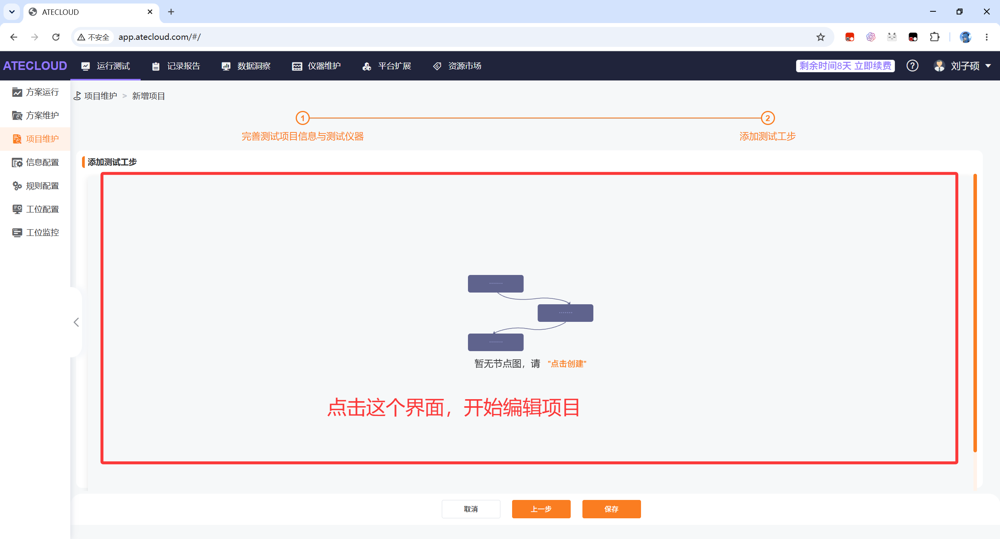

【图片27:编辑项目界面】

### 2.2.1、项目基础逻辑

测试项目流程有始有终。无论整个项目中有多少个节点，连线都必须从“开始”节点连接到“结束”节点，才能形成完整的可执行流程。

可以把它理解为一条“电路”：只有首尾接通、中间不断开，流程才能跑通。

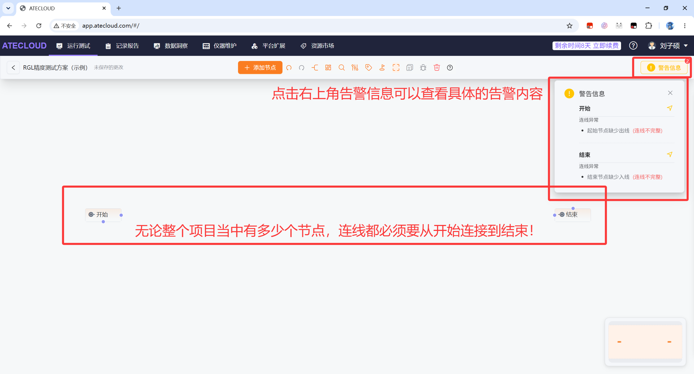

【图片28:项目基础逻辑】

### 2.2.2、添加节点

在 ATE 系统中，每一步操作都可以理解为一个节点。搭建项目的第一步就是添加节点：点击顶部工具栏中的“添加节点”按钮，弹出可操作的节点模块，将节点模块拖入画布即可完成放置。

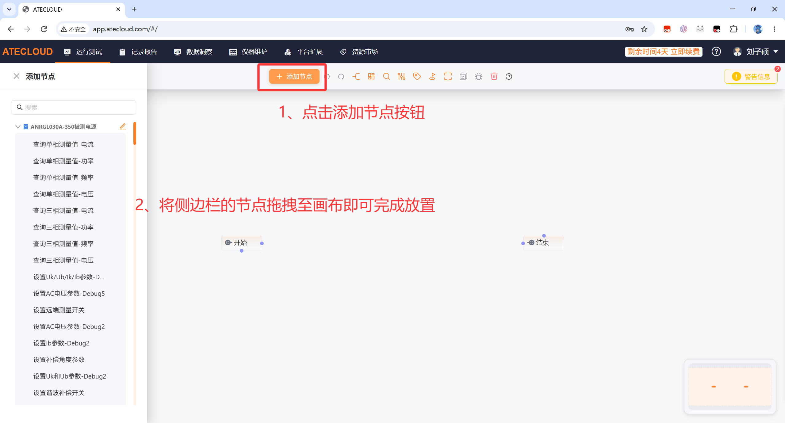

【图片29:添加节点界面】

为了便于选择，可以先看下面这张节点速查表：

| 节点 | 作用 | 典型使用场景 |
| --- | --- | --- |
| 仪器节点 | 向仪器发送命令或读取数据 | 设置电压、读取测量值 |
| 等待节点 | 延时等待 | 仪器需要响应时间 |
| 循环节点 | 重复执行相同操作 | 遍历多个电压测量点 |
| 计算节点 | 进行数学运算或调用算法 | 计算误差、精度 |
| 条件节点 | 根据结果进入不同分支 | 判断合格 / 不合格 |
| 信息提示节点 | 提示工程师进行手动操作 | 提醒接线、更换测试品 |
| 赋值节点 | 将数据写入全局变量 | 保存判断结果供报告使用 |
| 并行控制 | 同时控制多个设备 | 同时读取电压表和电流表 |
| 测试项目节点 | 调用已经发布的项目 | 复用已有子流程 |

下面逐一说明每种节点的用途。

#### 2.2.2.1、仪器节点

仪器节点是对仪器操作的封装。可以理解为一个仪器节点对应一次对仪器的命令发送或读取操作。

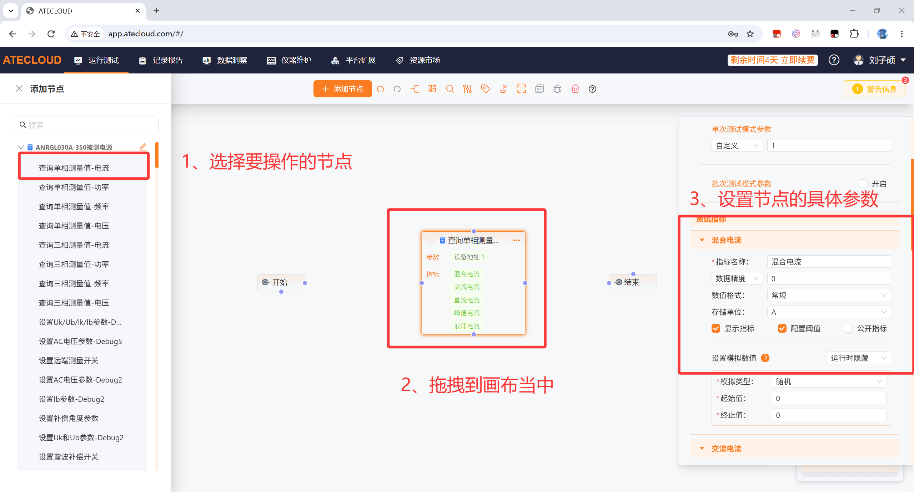

【图片30:仪器节点】

#### 2.2.2.2、等待节点

在测量电压、电流、功率等电源属性时，功率分析仪或万用表可能需要一定响应时间，此时需要延时读取。ATE 系统中的“等待节点”就是用来实现这一功能的。

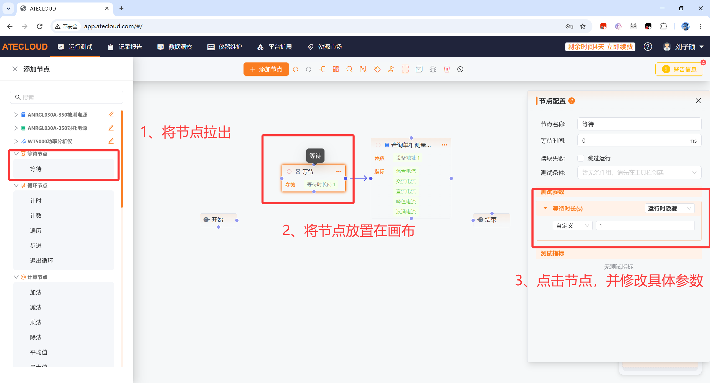

【图片31:等待节点】

#### 2.2.2.3、循环节点

循环节点用于处理需要重复执行多次的相同操作。例如测量电压精度时，测量步骤完全一致，只是电压测量点不同，使用循环节点可以避免重复搭建相同的流程。

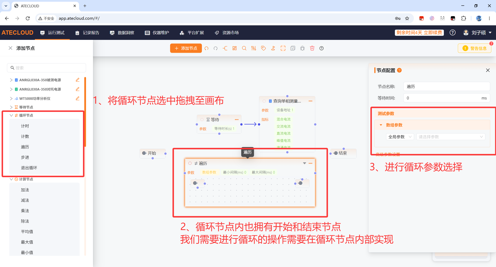

【图片32:循环节点（一）】

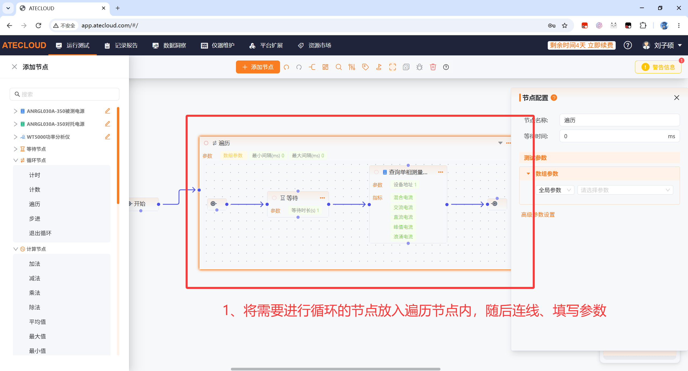

【图片33:循环节点（二）】

#### 2.2.2.4、计算节点

计算节点用于进行数学运算，或调用自定义算法来完成测试。

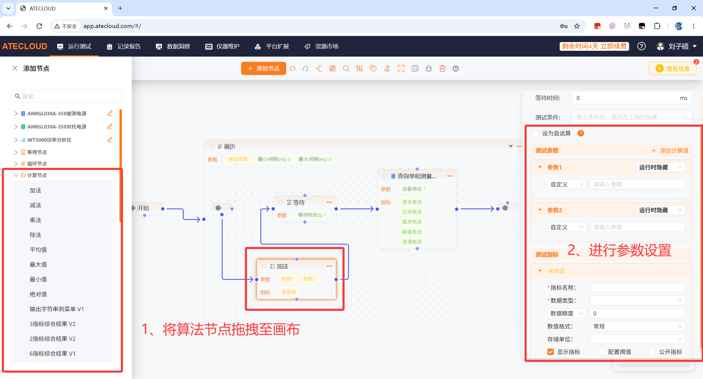

【图片34:计算节点】

#### 2.2.2.5、条件节点

条件节点用于对当前结果值进行判断，并根据判断结果进入不同分支，作用与 Python 中的 if/else 相同。

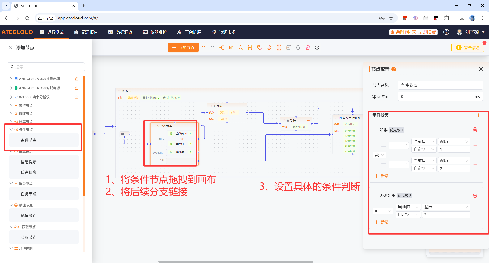

【图片35:条件节点】

#### 2.2.2.6、信息提示节点

信息提示节点用于在执行到某个位置时提醒工程师进行手动操作。这里包含两种节点块：

- **信息提示节点块**：只负责提示工程师信息，不对变量进行操作；
- **任务信息节点块**：除了提示信息外，还会对变量进行操作。

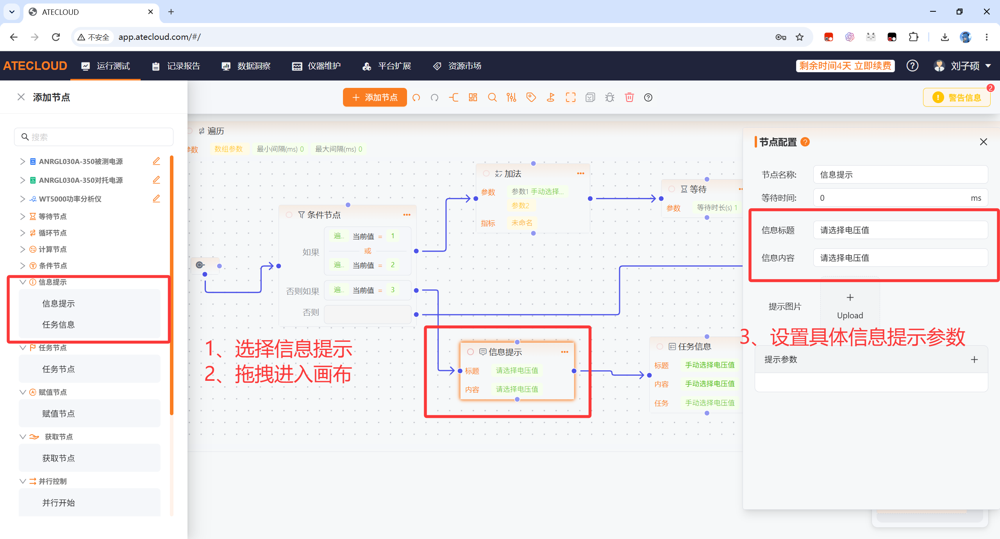

【图片36:信息提示节点】

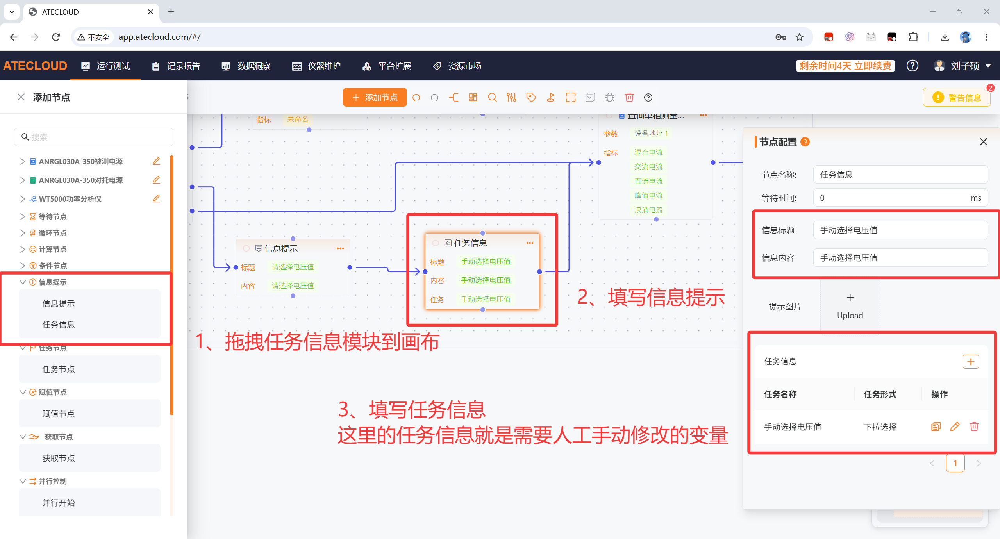

【图片37:任务信息节点】

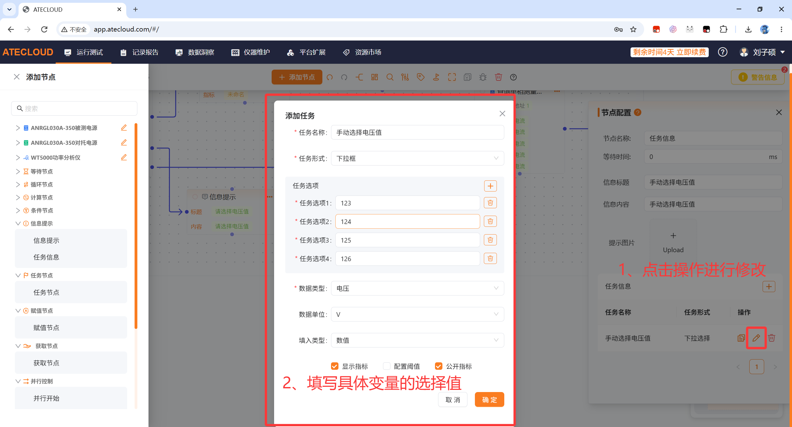

【图片38:信息提示节点配置】

#### 2.2.2.7、赋值节点

赋值节点用于将局部数据、全局数据或自定义数据写入全局变量。例如可以将合格 / 不合格的判断结果赋值给全局变量，供后续节点或报告使用。

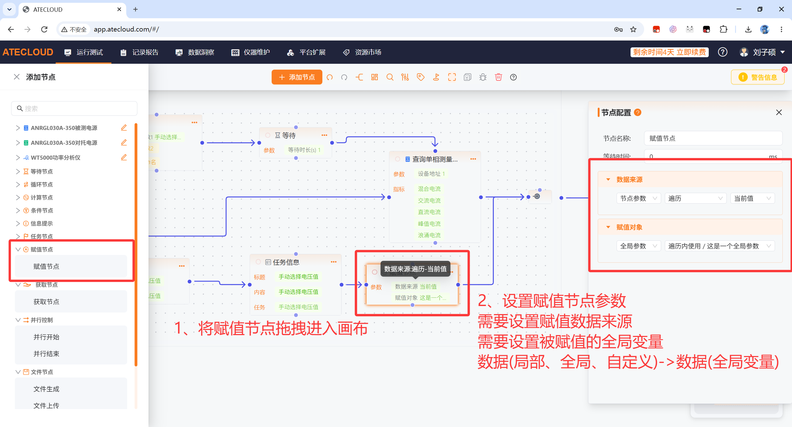

【图片39:赋值节点】

#### 2.2.2.8、并行控制（新功能）

并行控制是为解决多个设备需要同时控制的问题而推出的新功能。例如同时读取电压表和电流表：老版本只能顺序读取，新版本可以并行读取。操作方式如图所示。

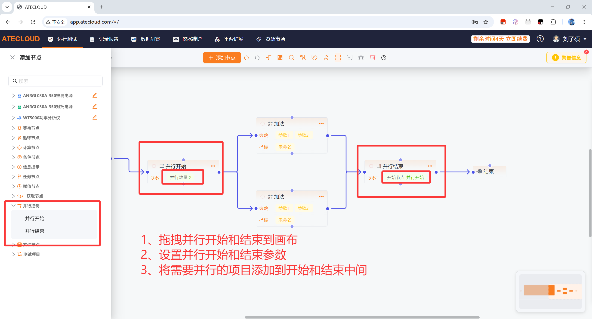

【图片40:并行控制】

#### 2.2.2.9、测试项目节点

测试项目节点用于调用已经编写好的项目，将其作为当前项目的子模块使用。

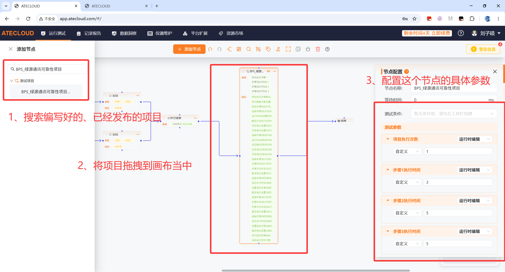

【图片41:测试项目节点调用】

### 2.2.3、全局参数

全局参数可以被整个项目中的所有节点调用，常用于显示合格判断结果、输入测试参数等场景。由于所有节点都能访问，全局参数适合保存项目中需要共享的数据。

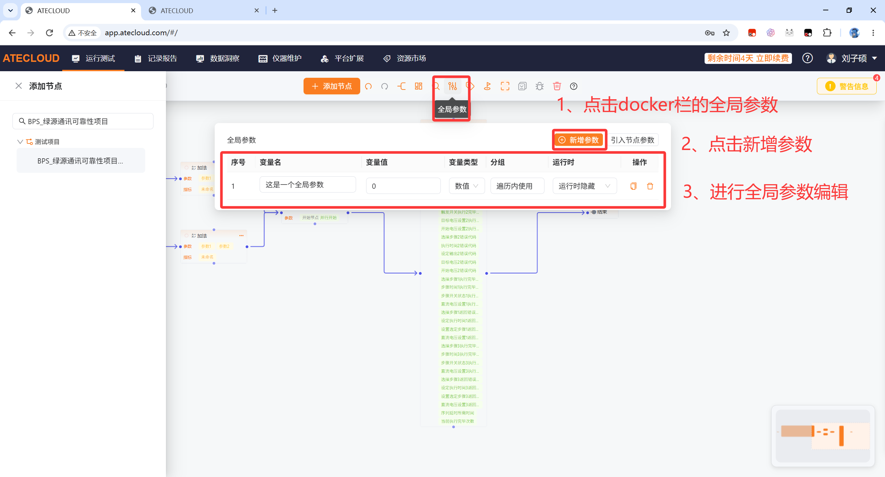

【图片42:全局参数】

## 2.3、修改项目

### 2.3.1、未发布项目更改

未发布项目的修改比较简单，它可以直接被编辑。具体操作如下：

1. 点击“项目维护”页面中的“编辑”按钮，进入项目的版本管理页面；
2. 点击对应未发布项目版本的“编辑”按钮，即可进入与新建项目时相同的编辑界面；
3. 按照 2.2 节“编辑项目”的步骤修改项目内容即可。

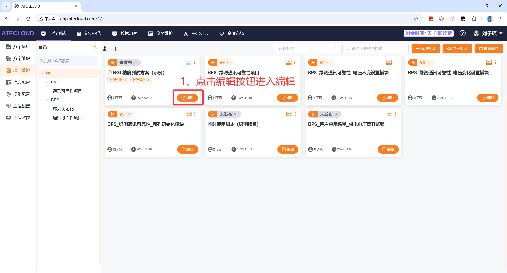

【图片43:未发布项目更改界面】

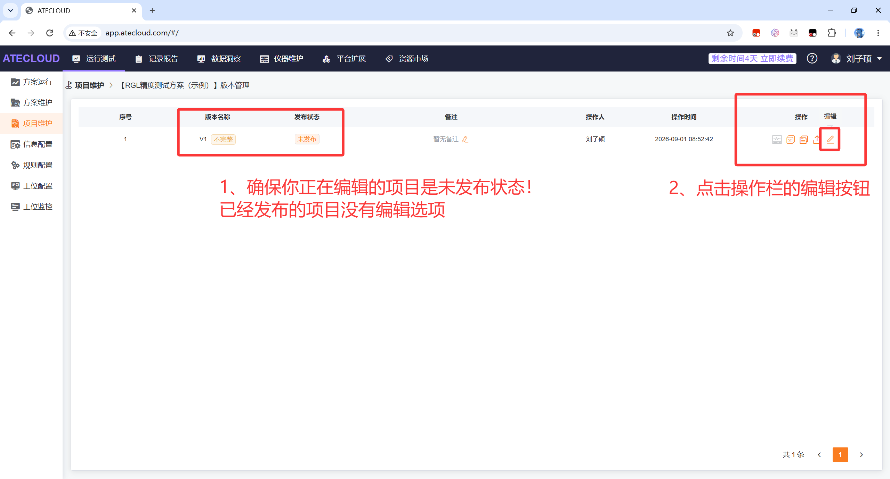

【图片44:未发布项目的版本管理页面】

### 2.3.2、已发布项目更改

已发布的项目已完成编辑并存档，服务器上会永久保留该版本副本。如需修改，需要以该已发布版本为模板创建新版本。具体操作如下：

1. 点击“项目维护”页面中的“编辑”按钮，进入项目的版本管理页面；
2. 点击对应已发布项目版本的“发布新版本”按钮；
3. 在弹出的窗口中填写新版本备注，系统会自动生成一个可编辑的新版本；
4. 后续的编辑工作都在这个新版本中进行。

> **为什么要这样做**：这样既能修改流程，又不会影响已经存档的旧版本，方便出现问题时回溯。

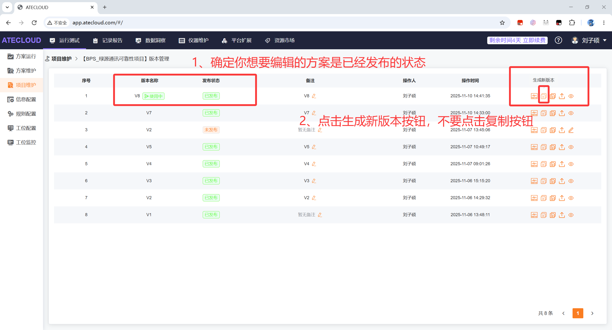

【图片45:已发布项目更改界面】

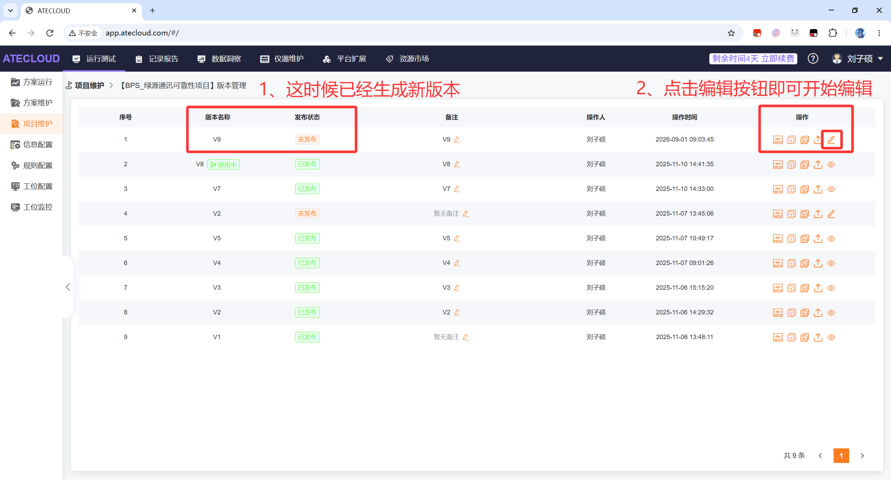

【图片46:ATE系统生成新版本界面】

## 2.4、发布项目

在确保完成项目编辑且调试通过后，即可发布项目。**只有发布后的项目，才能被方案调用。**

发布项目的主要操作如下：

1. 在“项目维护”界面找到需要发布的项目；
2. 确认当前编辑的版本已经保存；
3. 点击“发布”按钮，生成新的发布版本；
4. 发布后，方案即可调用该项目。

> **提示**：每次发布新版本都会保留一个版本记录，也可以手动选择要发布的版本。

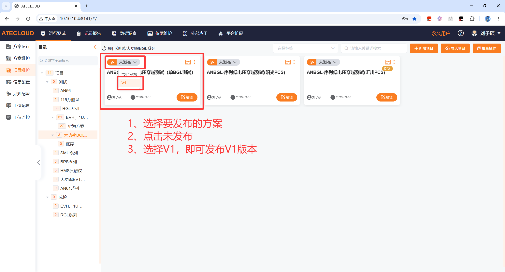

【图片47:发布项目界面】

# 三、方案搭建

> 本章介绍如何把已经发布的项目整合成方案，包括新建方案、配置参数包和发布方案。

## 本章导读：方案和项目是什么关系？

很多新人容易把“项目”和“方案”搞混，可以用两句话区分：

- **项目决定“怎么测”**：一条具体的测试流程，例如“电压精度测试”；
- **方案决定“测什么、按什么标准测”**：把多个项目组合成一次完整的测试任务，例如“华为精度测试”。

举个例子：

- 项目 A：华为精度测试——电压精度测试；
- 项目 B：华为精度测试——电流精度测试；
- 方案：华为精度测试 = 项目 A + 项目 B。

运行“华为精度测试”这个方案时，程序会自动运行它包含的两个项目，方便统一运行和管理。

方案还有两个项目没有的能力：

1. 可以制作**参数包**，快速切换不同型号电源的参数和判断标准；
2. 可以绑定**导出模板**，只有方案才能生成正式的导出报告（见第五章、第六章）。

因此，项目搭建完成后，还需要搭建方案，才能形成完整的、可交付的测试任务。

## 3.1、新建方案

新建方案的步骤如下：

1. 进入“方案维护”界面；
2. 点击右侧的“新建方案”按钮（部分版本显示为“创建方案”）；
3. 填写方案名称、方案描述；
4. 点击“方案工步”进入编辑；
5. 点击“添加节点”，在搜索框中输入已经发布的项目名称；
6. 将项目拖入画布并完成连线；
7. 保存并退出，方案制作完成。

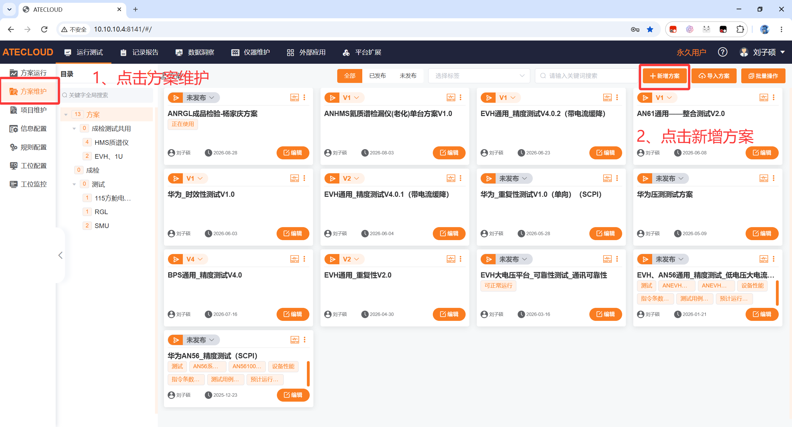

【图片48:方案创建界面】

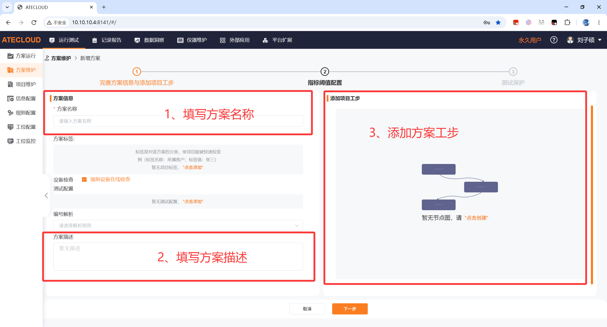

【图片49:方案创建详情】

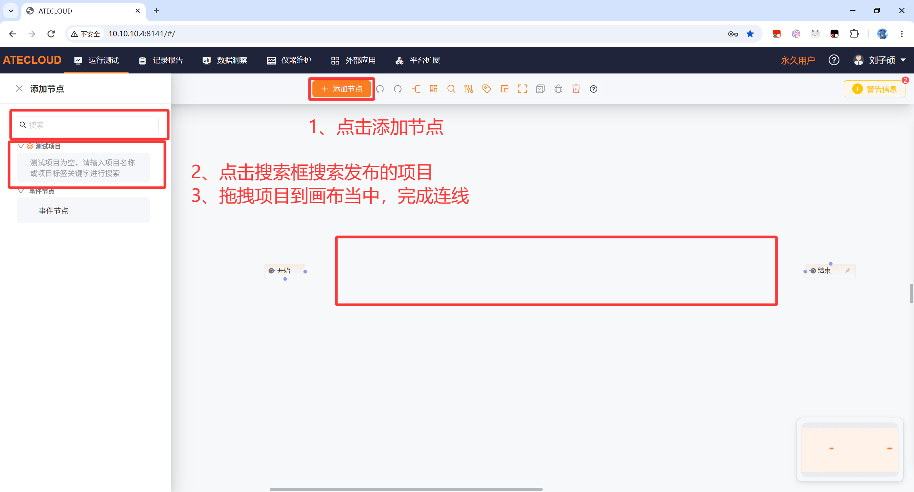

【图片50:方案工步详情】

如果你的方案当中存在阈值（勾选了），这个时候将会提示你填写具体的阈值。以后运行这个方案时，系统会根据阈值显示绿色或红色，表示是否超过阈值。

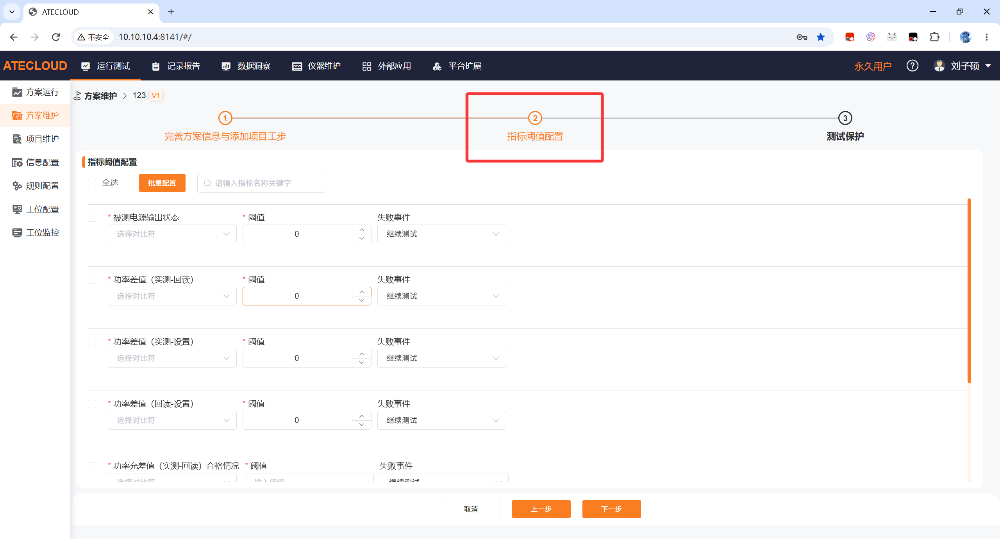

【图片51:阈值设置详情】

## 3.2、方案参数包

**为什么需要参数包？** 同一个方案可能需要适配不同型号的电源，而不同型号的参数和判断标准并不相同。如果每次测试都手动改一遍参数，既麻烦又容易出错。参数包就是把这些“成套的参数 + 判断标准”提前保存好，运行时直接选用。

制作参数包的步骤：

1. 进入参数包选项；
2. 点击“创建参数包”；
3. 进入具体的参数包设置页面；
4. 填写要传给系统的参数，也可以设置阈值；
5. 调整好参数后点击“保存”即可。

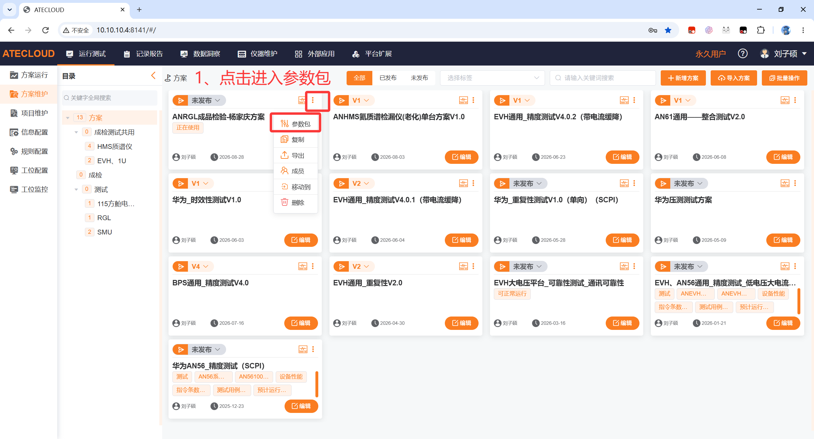

【图片52:参数包选项】

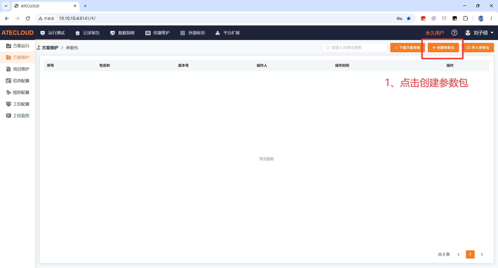

【图片53:参数包创建】

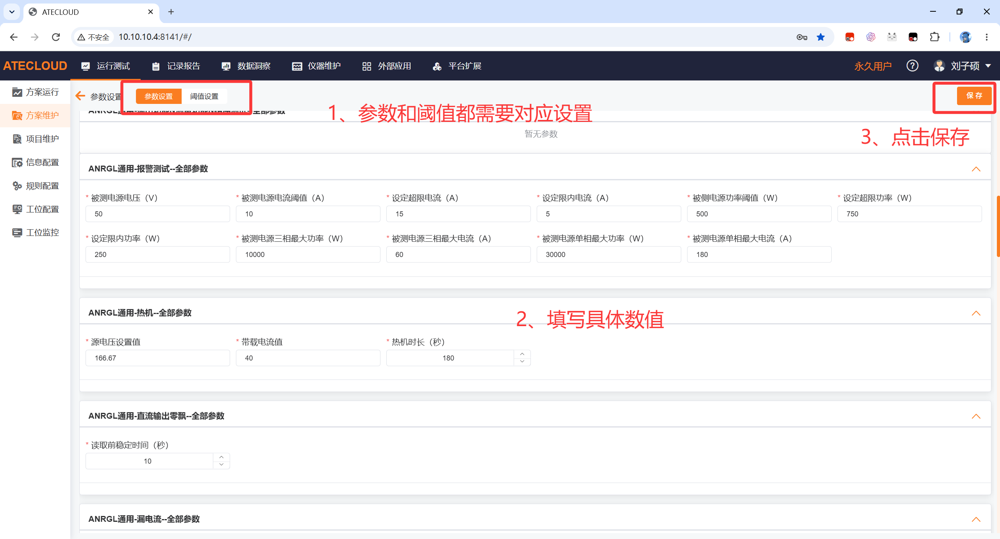

【图片54:参数包编辑】

## 3.3、发布方案

完成参数包编辑和方案编辑后，需要将方案进行发布。发布之后即可存档并使用，也才能在“方案运行”界面运行，并用于数据导出和报告生成。

发布前建议确认：

- 方案名称、描述已填写完整；
- 方案中包含的项目都已经发布；
- 流程已从“开始”连接到“结束”；
- 参数包已按型号配置并保存。

## 3.4、方案搭建自检清单

方案发布前，可以对照下面这份清单逐项检查：

- [ ] 方案名称、方案描述填写完整；
- [ ] 方案中包含的项目都已发布；
- [ ] 节点已从“开始”连到“结束”；
- [ ] 需要判断结果的测试项已设置阈值；
- [ ] 参数包已按型号配置并保存；
- [ ] 调试通过后已点击“发布”。

完成以上步骤后，就可以进入下一章，学习如何运行测试了。

# 四、运行测试

> 本章介绍一次完整测试的执行过程：测试前检查工位、选择方案和参数包、认识运行界面，以及测试过程中的注意事项。

## 本章你将了解

- 运行测试前需要检查哪些内容
- 如何选择方案、工位和参数包
- 运行界面上各个区域分别是什么、怎么看
- 测试过程中遇到问题该怎么办

在完成方案搭建之后，就可以运行测试了。运行测试并不是简单地点一下“运行”，而是需要按照固定流程逐步确认，避免因为设备不在线、工位选错或参数包选错导致测试失败或误判。

## 4.1、测试前工位检查

### 4.1.1、为什么要先做检查

在运行测试之前，第一件事就是检查工位。因为系统在运行前会进行自检：**如果方案中用到的设备没有一一对应地在工位上在线，系统就不会弹出进入测试的按钮。** 也就是说，设备没准备好，方案根本无法启动。

检查的目的只有一个：确认“方案需要的设备”在“你的工位”上都已经在线，并且可以正常使用。

### 4.1.2、检查步骤

1. 点击进入“工位配置”界面；
2. 找到你自己的工位，确认工位是否在线；
3. 检查方案中需要用到的设备是否都正常在线；
4. 有些设备需要使用解析器，请检查解析器是否为最新版本；
5. 如果工位缺少方案中需要的设备，点击“添加设备”进行添加。

> **提示**：如果设备一直无法上线，或添加设备后仍无法使用，请到工位页面查看日志，并联系工位维护人员处理；如需使用新工位、新 BOX，或没有添加设备的权限，请联系李瑞香或刘子硕。

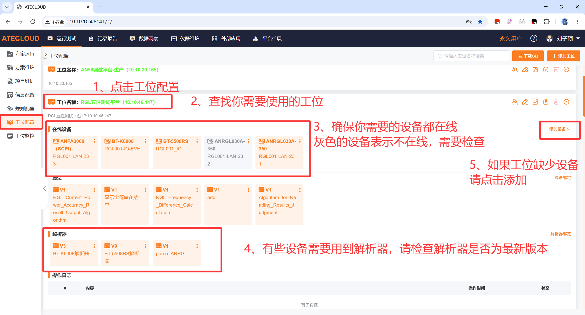

【图片55:工位检查】

## 4.2、选择方案与工位

在完成工位检查并确认无误后，就可以开始运行方案了。

操作步骤：

1. 点击进入“方案运行”界面；
2. 选择需要运行的方案（如果找不到，先确认方案是否已经发布）；
3. 点击“运行”按钮；
4. 按提示选择本次使用的工位。

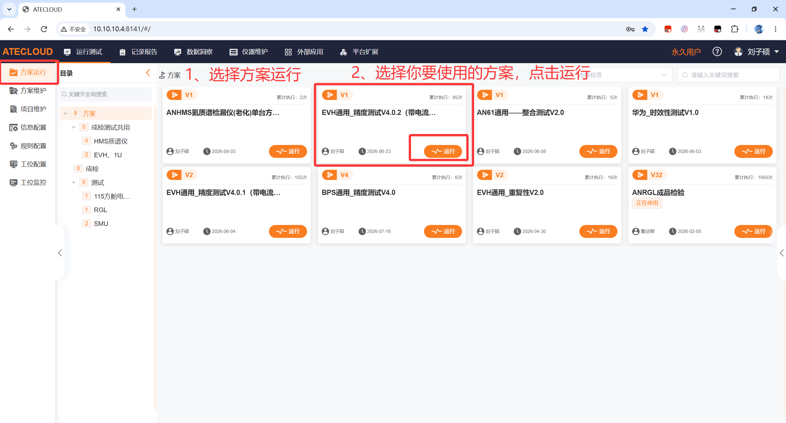

【图片56:运行界面】

点击“运行”后，系统会弹出工位选择窗口。

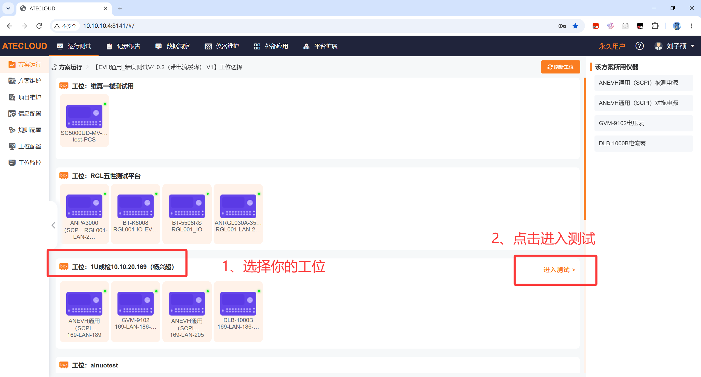

【图片57:工位选择界面】

> **首次运行提示**：如果方案中有多个相同型号的仪器，第一次运行时系统会让你把“方案里的仪器”和“工位上实际的仪器”对应起来。对应关系必须选择正确，否则测试数据可能来自错误的设备。

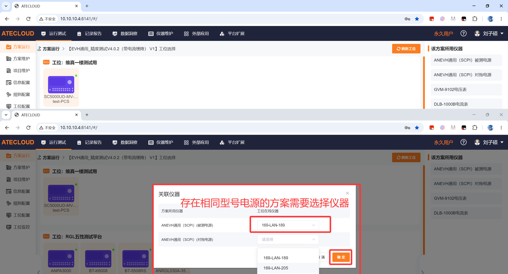

【图片58:仪器选择界面】

## 4.3、运行界面详解

进入运行界面后，界面显示的信息比较多。下面按区域逐一说明，第一次使用建议对照界面看一遍。

### 4.3.1、测试项目栏

测试项目栏用于展示当前正在测试的项目，包括测试结论（PASS / FAIL）、项目名称、编号等信息。

**怎么看**：先看结论是 PASS 还是 FAIL；如果是 FAIL，再结合“测试数据栏”定位是哪个测量点没有通过。

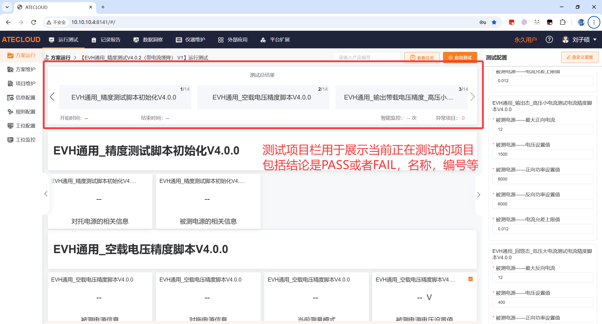

【图片59:测试项目栏】

### 4.3.2、测试数据栏

测试数据栏用于展示整个方案中所有需要展示的数据，例如电压值、电流值等。

**怎么看**：这里显示的是各个测量点的实际结果，是判断测试是否合格的主要依据。

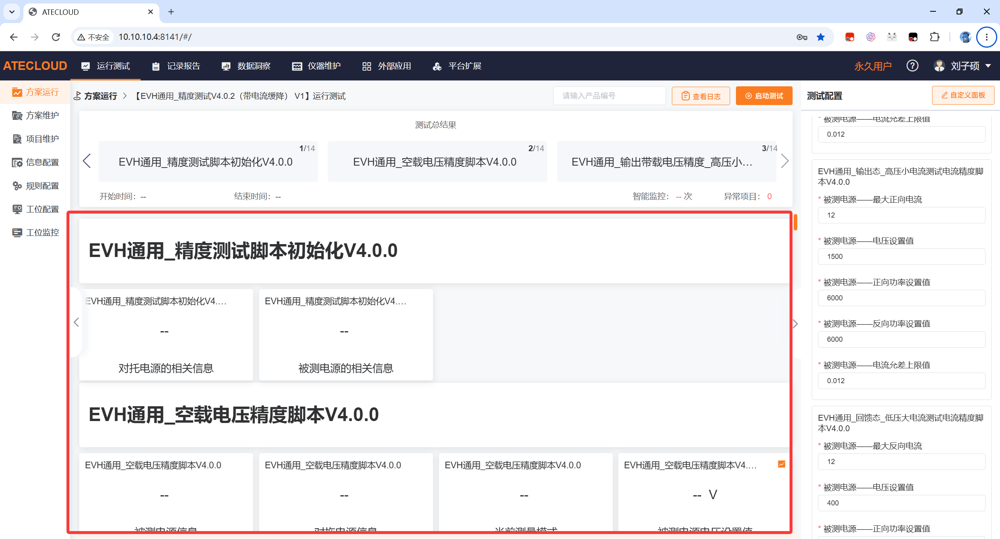

【图片60:测试数据栏】

### 4.3.3、产品编号侧边栏

产品编号侧边栏用于设置是否连续测试。通过“编号自增”和“批量测试”，可以连续完成多轮测试，并分别记录每一轮的数据。

**怎么用**：

- 只测一台产品时，直接填写产品编号即可；
- 需要连续测多台时，开启“编号自增”并设置批量数量，系统会自动按编号逐个测试并保存记录。

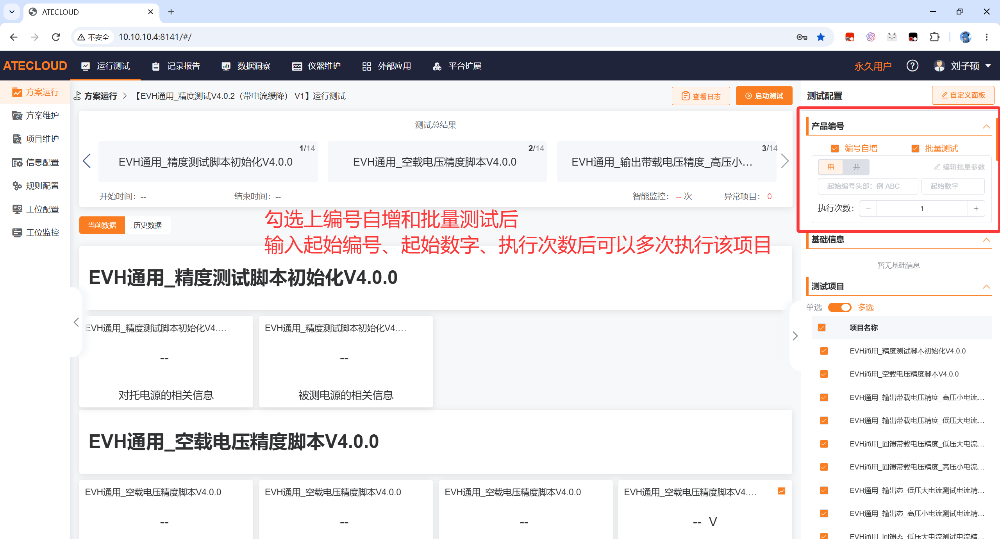

【图片61:产品编号侧边栏】

### 4.3.4、测试项目侧边栏

测试项目侧边栏用于选择本轮测试要执行方案中的哪些项目：**勾选表示执行，不勾选表示不执行。**

**怎么用**：如果本轮只需要测试其中某几项，可以在这里只勾选对应项目，避免重复运行整个方案。

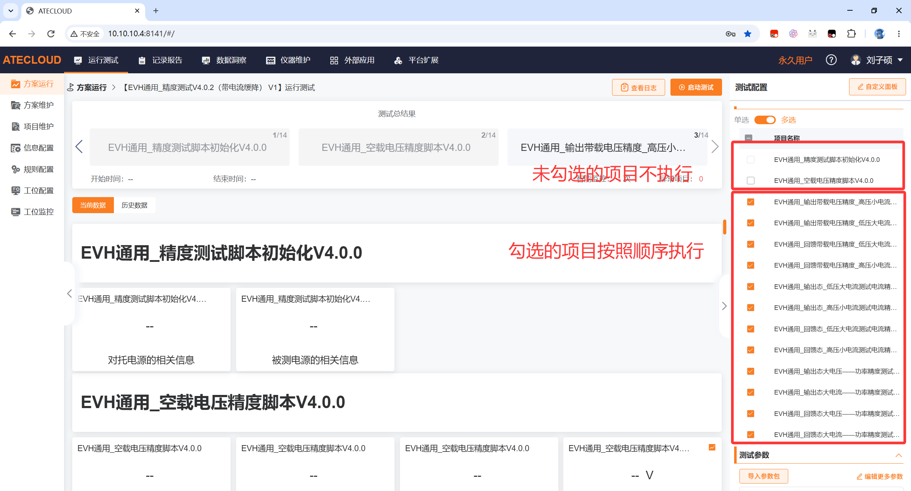

【图片62:测试项目侧边栏】

### 4.3.5、测试参数侧边栏

测试参数侧边栏是整套测试方案的输入区域。可以选择导入参数包进行一键配置，也可以点击“编辑更多参数”按钮手动编辑。

**怎么用**：

1. 优先选择已经配置好的参数包，省时且不易出错；
2. 参数包不满足需求时，再点击“编辑更多参数”手动调整；
3. 参数确认无误后，再启动测试。

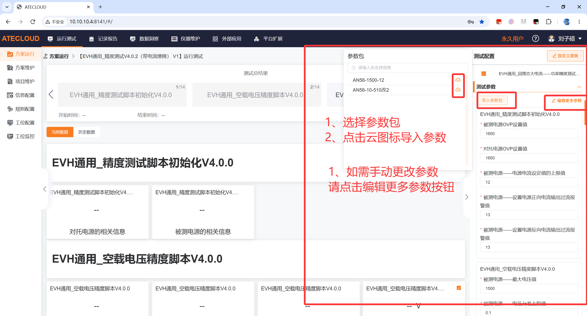

【图片63:测试参数侧边栏】

### 4.3.6、顶部栏

顶部栏主要显示当前测试的是哪一个方案，并提供单次测试的产品编号输入框、启动测试按钮、查看日志按钮等。

**怎么用**：

- 在编号输入框中填写本次产品的编号；
- 点击“启动测试”开始执行；
- 测试异常时，点击“查看日志”查看运行记录，帮助定位问题。

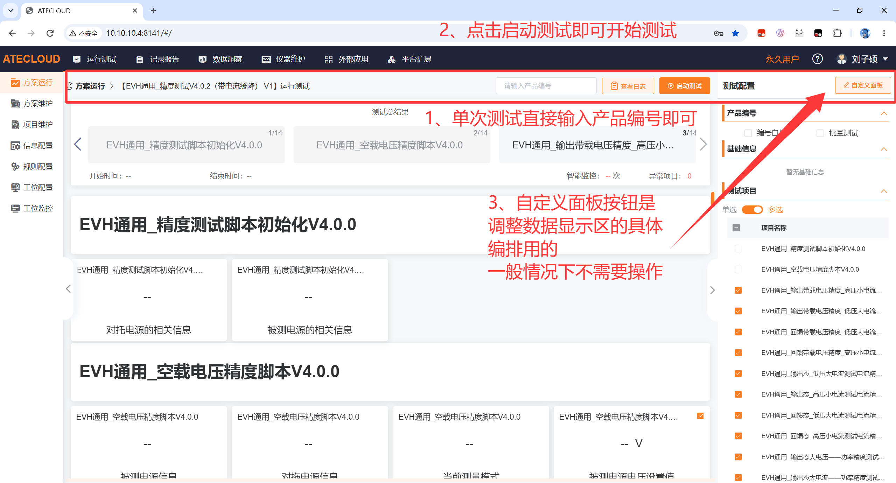

【图片64:顶部栏】

## 4.4、测试过程中的注意事项

1. **不要随意断开设备**：测试过程中不要拔插仪器通讯线、被测品接线，也不要关闭仪器电源。
2. **留意提示信息**：如果流程中包含信息提示节点，界面会提示你进行接线、更换测试品等操作，按要求完成后再继续。
3. **选对参数包**：不同型号产品对应不同参数包，选错会导致判断标准错误，甚至把合格品判为不合格。
4. **异常及时记录**：出现报错或连接失败时，先记下提示信息，再到“工位配置”查看日志，必要时联系方案维护人员。

## 4.5、测试完成后的下一步

一次测试执行完成后：

- 在运行界面确认测试结论（PASS / FAIL）和测试数据；
- 需要查看历史记录时，进入“测试记录”界面；
- 需要把数据导出为表格或 Word 时，可在“测试记录”中直接导出；
- 需要生成正式报告时，先按第五章制作导出模板，再按第六章导出报告。

> **本章小结**：运行测试的标准流程是——**先检查工位，再选方案和参数包，确认仪器对应关系，然后启动测试，最后查看结论并导出数据。**

# 五、报告模板

> 本章介绍如何制作导出模板。测试完成后的数据会保存在服务器上，但系统并不知道每条数据应该放在导出表格的哪个位置，因此需要我们提前制作模板，告诉系统“哪条数据填到哪个格子里”。

## 本章你将了解

- 制作导出模板的前提条件
- 如何进入模板管理并新建模板
- 如何选择要导出的方案和数据
- 如何获取数据的“变量编号”
- 如何制作 Excel / Word 模板并上传到 ATE 平台
- 制作模板时的注意事项

## 5.1、导出模板制作与录入ATE平台

### 5.1.1、制作前提

制作导出模板前，必须已经有一个**已发布的方案**。如果方案还没有发布，将无法制作模板。

因此，开始制作前请先确认目标方案已经发布。

### 5.1.2、进入模板管理

1. 点击“记录报告”；
2. 点击“模板管理”按钮，进入模板制作页面；
3. 点击“模板配置”，开始新建导出模板。

如果要修改已有模板，在“操作”一栏中点击铅笔按钮即可编辑。

> **注意**：这里指的是模板制作 / 编辑页面——你只能看到自己制作的版本，看不到其他同事制作的版本。**但在导出报告时，全公司的模板可以相互看到并选用**（详见第六章）。

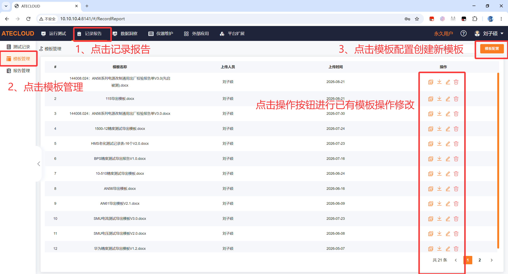

【图片65:模板制作页面】

### 5.1.3、选择源数据

正式制作模板前，需要先选择为哪一个方案制作模板。

1. 点击“添加方案”；
2. 选择要导出的项目；
3. 点击“确定”。

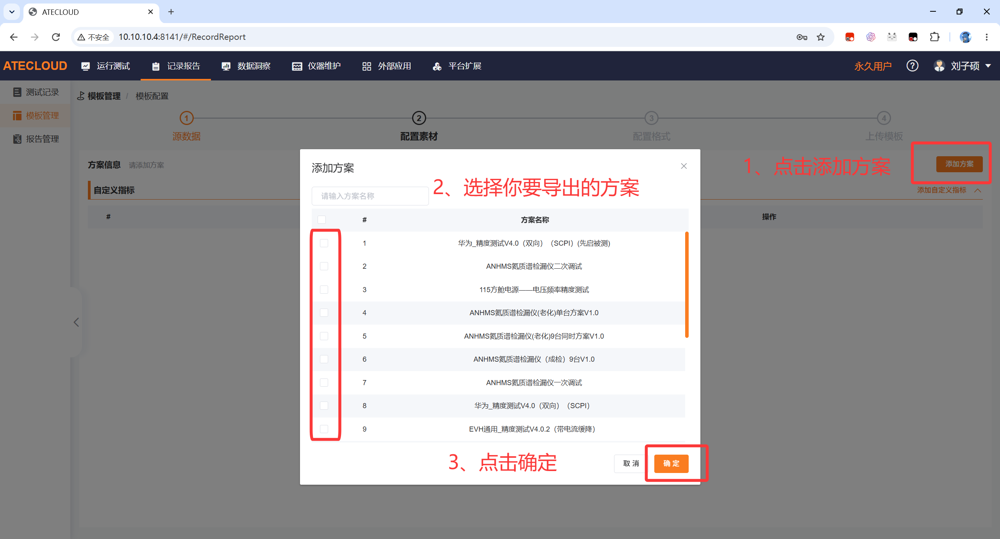

【图片66:源数据选择页面】

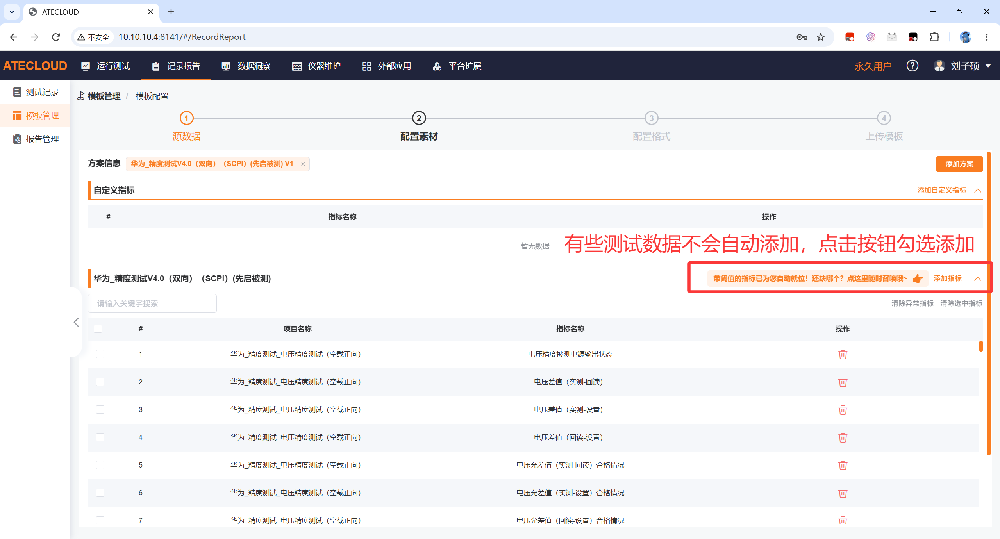

【图片67:方案测试数据选择页面】

### 5.1.4、获取数据的变量编号

选择好方案中的数据后，点击“配置素材”按钮。

这个页面会把测试数据的**全部实际编号**展示出来。系统就是通过这些编号来存储和读取数据的，可以把它理解成编程语言中的“变量”：

- **编号** = 变量名；
- **测试数据值** = 变量值。

想要获取变量值，就必须先拿到对应的变量名。例如“电压差值（实测-回读）”对应的变量名称为：

```text
{5e89ppbomm1ijeg}
```

> **提示**：变量名称需要原样复制（包括大括号），不要手动修改，否则系统无法识别。

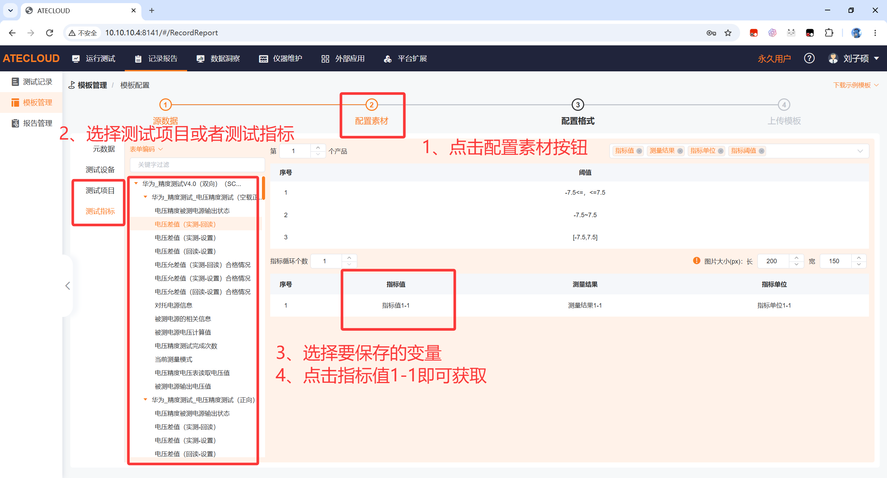

【图片68:配置素材页面】

### 5.1.5、制作 Excel / Word 模板

拿到变量名称后，需要把它填入 Excel 或 Word 中。下面以 Excel 为例。

变量名称填在哪个单元格，将来这个数据就会出现在导出表格的哪个位置。因此，建议先规划好导出表格的样式，再把变量名称填进对应单元格。

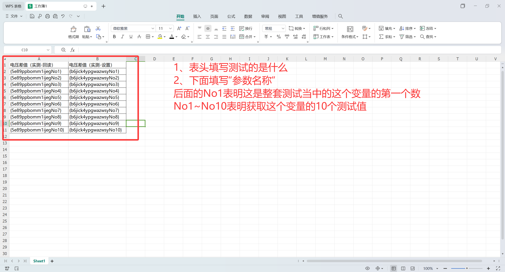

【图片69:配置excel素材】

编写好 Excel 后，将其保存到本地电脑。

> **重要提醒**：保存文件时**不要对 Excel 或 Word 加密**！加密会破坏文件格式，直接导致 ATE 系统无法读取，最终模板制作失败。

### 5.1.6、配置格式

点击“配置格式”按钮，进入配置格式页面。在这个页面可以设置导出文件的名称。

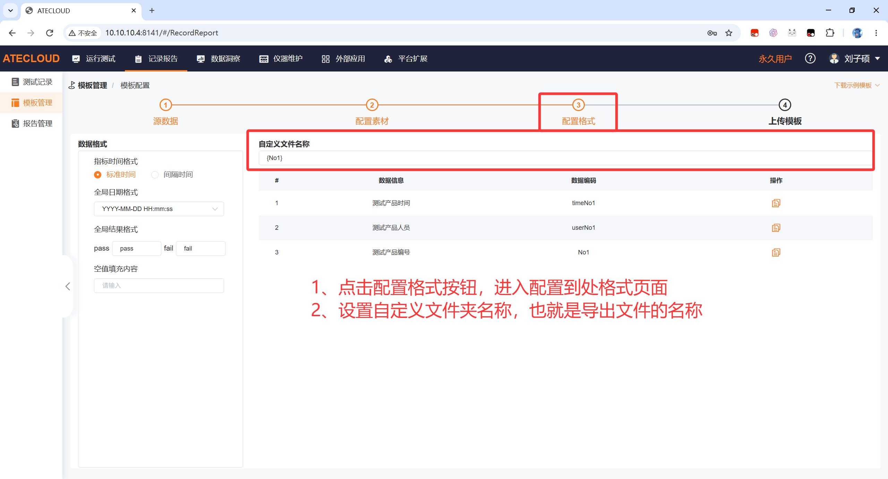

【图片70:配置格式页面】

### 5.1.7、上传模板

最后点击“上传模板”按钮，进入上传模板页面，把制作好的 Excel 或 Word 上传上去，告诉 ATE 系统导出文件应该导出成什么样子。

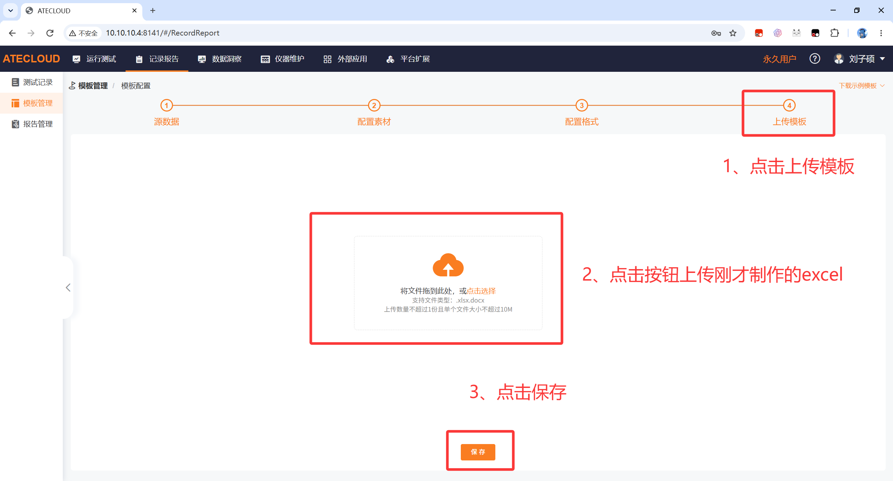

【图片71:上传模板页面】

### 5.1.8、制作流程小结

导出模板的制作流程可以概括为：

**确认方案已发布 → 模板管理 → 新建模板 → 选择源数据 → 复制变量编号 → 填入 Excel / Word → 配置格式 → 上传模板**

> **常见问题**：如果模板制作失败，优先检查两点——一是方案是否已经发布，二是 Excel / Word 是否被加密。

# 六、导出报告

> 本章介绍如何把已经完成的测试数据，按照第五章制作好的模板，一键导出为报告文件。

## 本章你将了解

- 导出报告前需要准备什么
- 如何选择测试数据并导出
- 报告文件下载到哪里、找不到怎么办

模板制作完成后，导出报告就很简单了：先在测试记录中找到要导出的数据，再选择对应模板，系统就会自动生成并下载报告。

## 6.1、导出报告操作

### 6.1.1、导出前准备

开始导出前，请先确认：

- 已经为对应方案制作并上传了导出模板（见第五章）；
- 测试记录中存在需要导出的数据；
- 导出时可以选用全公司共享的模板，不限于自己制作的版本。

> **补充说明**：模板“只能看到自己制作的版本”这一限制，只出现在模板制作 / 编辑页面；在导出报告时，公司同事制作的模板都可以相互看到并选用。

### 6.1.2、操作步骤

1. 点击“记录报告”；
2. 点击“测试记录”；
3. 选择要导出的测试数据；
4. 点击“单模板导出”，再点击“导出选中”；
5. 选择要使用的导出模板名称（自己或同事制作的模板都可以）；
6. 点击“生成报告”，随后浏览器会自动开始下载报告文件。

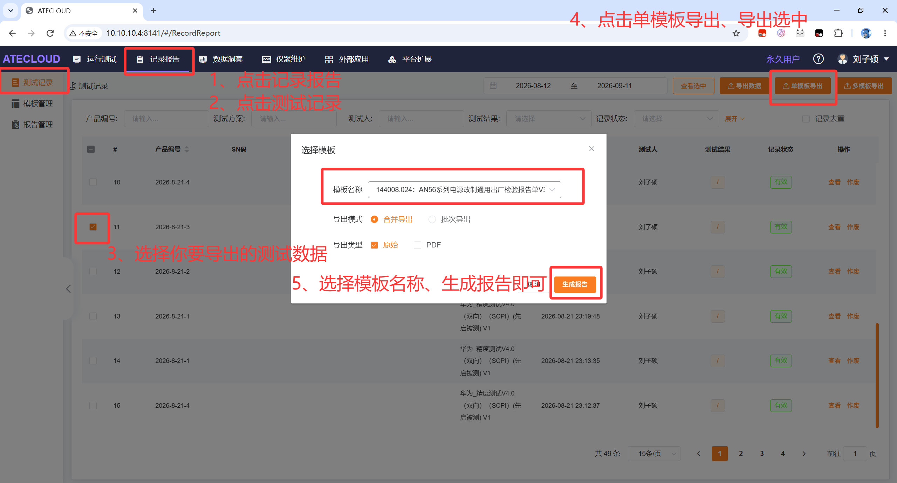

【图片72:导出报告页面】

### 6.1.3、找不到下载的文件怎么办

如果浏览器没有自动下载，或者下载后找不到文件，可以：

1. 检查浏览器是否拦截了自动下载；
2. 进入“记录报告 → 报告管理”，这里保存着所有已导出的报告副本，可以查看导出后的实际效果，也可以重新下载。

### 6.1.4、注意事项

- 导出前先通过测试时间、产品编号等信息，确认选中的确实是本次要导出的数据；
- 如果找不到想要的模板，先确认模板是否已经制作并上传；导出时可以选用全公司共享的模板，不必局限在自己的模板里；
- 报告生成后建议及时归档到指定目录，方便后续查找。

> **本章小结**：导出报告的流程是——**记录报告 → 测试记录 → 选择数据 → 单模板导出 → 选择模板 → 生成报告**。

# 七、仪器录入与命令修改

> 学到这里，说明你已经能熟练操作 ATE 测试系统了。前面几章的工作更像是在“搭积木”，而本章开始，我们要学会“创造积木”——把新仪器接入系统，并录入它的控制命令。这一步难度更高，建议多向熟悉系统的工程师请教，才能更快掌握并发挥系统的特性。

## 本章你将了解

- 仪器类型和仪器型号分别是什么、什么时候需要新增
- 录入仪器型号时需要填写哪些关键参数
- SCPI 命令的两种类型：设置命令与查询命令
- 如何录入、保存和验证指令
- 非 SCPI 命令和 SCPI 命令的区别，以及解析器在其中起的作用

## 7.1、仪器类型录入与修改

仪器类型界面平时用得不多，它的作用只是告诉使用者这台仪器属于哪一类，例如 RGL 电源、EVH 电源、功率分析仪等。

**什么时候需要新增**：当系统里找不到设备对应的类型时，才需要新增。

**操作步骤**：

1. 点击“仪器维护”；
2. 点击“仪器类型”；
3. 点击“新增”；
4. 填写类型名称并保存。

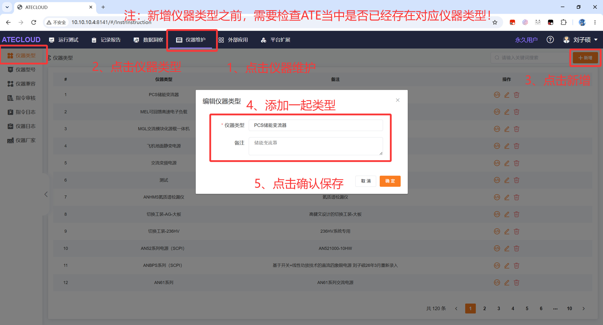

【图片73:仪器类型创建页面】

## 7.2、仪器型号录入与修改

设置好仪器类型后，就可以添加或修改具体的仪器型号了。

**操作步骤**：

1. 点击“仪器维护”；
2. 点击“仪器型号”；
3. 点击“新增”或“添加”；
4. 填写基本参数后保存。

**关键参数说明**：

| 参数 | 说明 |
| --- | --- |
| 指令类型 | SCPI 选择 ASCII；AN3.0、Modbus 等选择 HEX |
| 是否读取返回值 | 看设置命令有没有回传。例如 HMS 质谱仪的设置命令会回传 OK，这种情况就选择“是”；没有回传则选择“否” |
| 解析器 | 如果是 SCPI 协议，不需要选择解析器；其他协议选择对应的解析器 |
| 指令结束符 | 如果命令需要以回车换行结尾，就选择对应的结束符 |

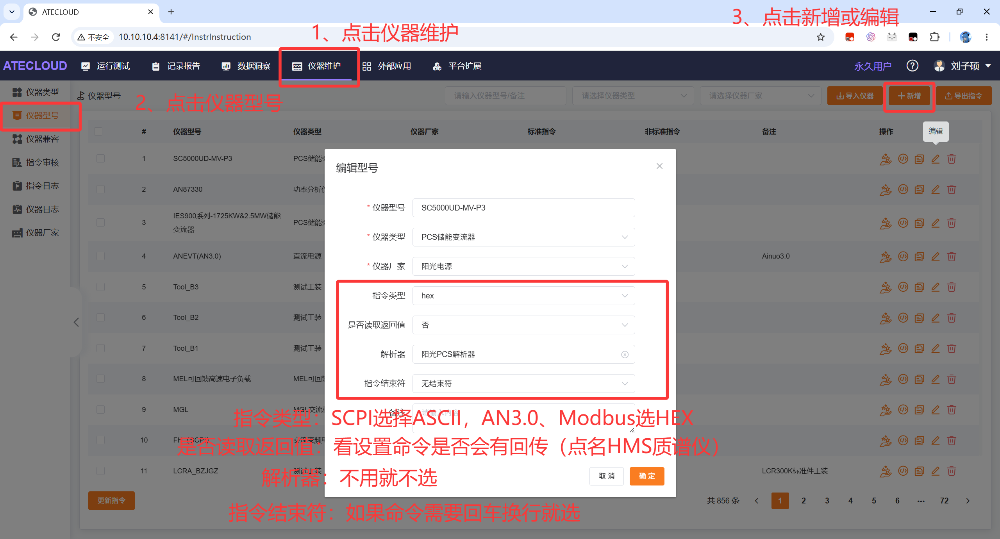

【图片74:仪器型号页面】

添加完仪器型号，相当于在系统中“创建了一个对象”，但这个对象还没有具体的方法。因此，接下来还需要录入指令，告诉系统“怎么操作这台仪器”。

## 7.3、SCPI命令录入

SCPI 是最常见的仪器控制协议，大部分测量仪器都支持。SCPI 命令主要分为两类：

- **设置命令**：向仪器发送设置类指令，例如设置电压值；
- **查询命令**：向仪器发送读取类指令，例如读取电压值、电流值。

两种命令都从“仪器型号”页面点击“指令维护”进入。

### 7.3.1、设置命令录入

设置命令用于向仪器发送设置类指令。这类命令通常不需要仪器回复，例如设置电压值。

**操作步骤**：

1. 点击“+ 添加指令”；
2. 编辑指令名称、指令编码、指令模板；
3. 如果需要传参，点击“添加参数”，并修改下方具体参数。

**字段说明**：

| 字段 | 说明 |
| --- | --- |
| 指令名称 | 给人看的名称，便于识别 |
| 指令编码 | 给机器识别的编码 |
| 指令模板 | 实际发送给仪器的命令内容 |

> **提示**：如果需要添加可变参数，要把指令模板中的变量写成 `{{XXX}}` 的格式（双大括号）。

**参数字段说明**：

| 字段 | 说明 |
| --- | --- |
| 参数名称 | 给人看的名称，便于识别 |
| 参数编码 | 给机器和指令模板使用的变量名 |
| 参数分类 | 这个变量属于哪一类，例如电压、电流、频率等 |
| 参数类型 | 以什么方式读取返回值 |

> **重要提醒**：
>
> 1. 命令编写完成后**必须点击“保存”按钮**，命令不会自动保存！
> 2. 点击“验证”按钮，可以验证命令是否可用。

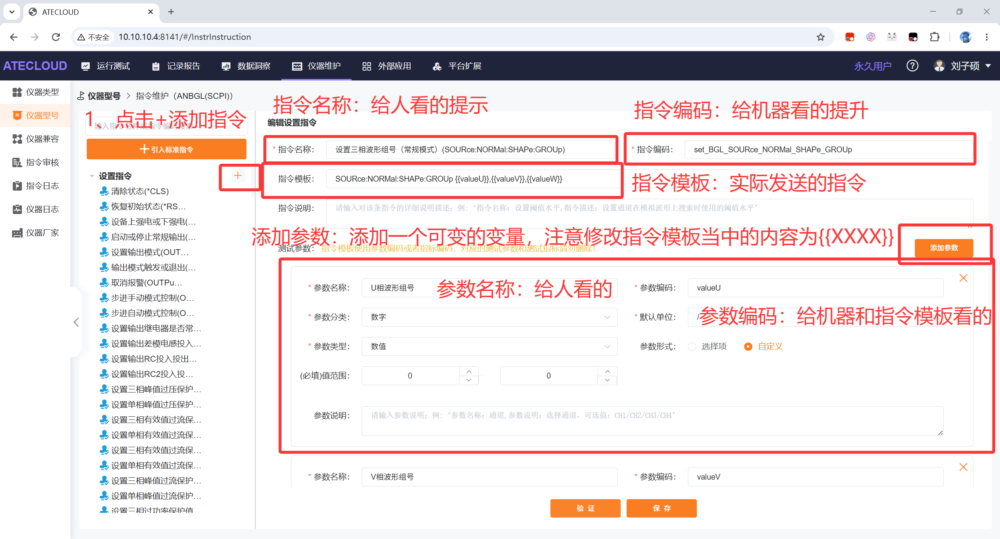

【图片75:设置命令页面】

### 7.3.2、查询命令录入

查询命令的录入方式与设置命令基本一致，区别是多了**测试指标**。

测试指标用于存放查询命令发出后仪器返回的内容，例如电压的读取值。

**测试指标字段说明**：

| 字段 | 说明 |
| --- | --- |
| 指标名称 | 给人看的名称，便于识别 |
| 指标编码 | 给机器识别的编码 |
| 指标类型 | 以什么方式读取返回值 |
| 指标分类 | 这个变量属于哪一类，例如电压、电流、频率等 |

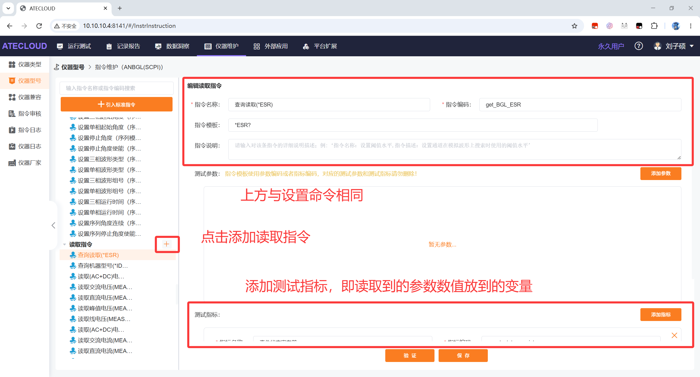

【图片76:查询命令页面】

## 7.4、非SCPI命令录入

有一些设备不支持 SCPI 协议，或者机型比较老，使用的是非标准协议。例如汇川、阳光的 PCS，它们虽然都使用 Modbus 协议，但命令格式完全不同。面对这类设备，就需要用非 SCPI 的方式录入命令。

**核心思路**：字段说明与 SCPI 命令一样，照常填写即可。唯一不同的是——**指令模板不再是实际发送的命令，而是作为参数输入框**。录入时，在指令模板中填写参数的编码即可，实际命令由解析器负责生成。

| 对比项 | SCPI 命令 | 非 SCPI 命令 |
| --- | --- | --- |
| 指令模板 | 实际发送给仪器的命令 | 参数输入框，填写参数编码 |
| 实际命令 | 由指令模板直接发出 | 由解析器根据参数生成 |
| 是否依赖解析器 | 不需要 | 需要（见第八章） |

### 7.4.1、设置命令录入

1. 指令名称和指令编码正常填写即可；
2. 有几个变量，就在指令模板中填写几个变量的参数编码；
3. 剩余工作交给解析器处理。

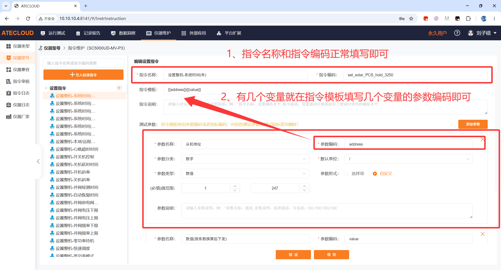

【图片77:非SCPI命令设置命令录入】

### 7.4.2、查询命令录入

1. 指令名称和指令编码正常填写即可；
2. 有几个变量，就在指令模板中填写几个变量的参数编码；
3. 剩余工作交给解析器处理。

> **注意**：查询命令别忘了添加**测试指标**，但测试指标不需要填写到指令模板中。

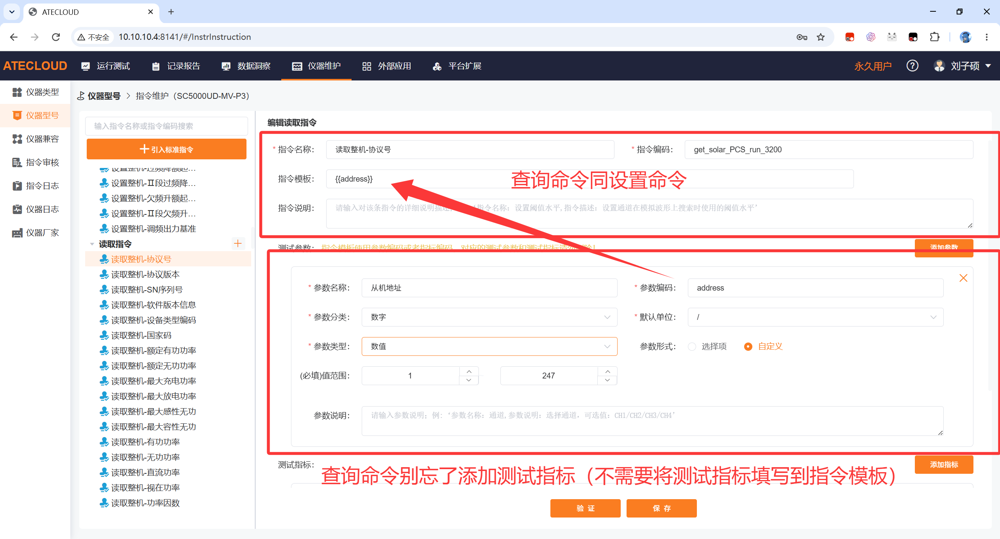

【图片78:非SCPI命令查询命令录入】

## 7.5、本章小结

- **仪器类型**：说明仪器属于哪一类，例如电源、功率分析仪；
- **仪器型号**：对应具体设备，需要配置指令类型、是否读取返回值、解析器和指令结束符；
- **SCPI 命令**：指令模板就是实际发送的命令；
- **非 SCPI 命令**：指令模板是参数输入框，实际命令由解析器生成；
- **通用规则**：命令编写完成后必须点击“保存”，建议再点击“验证”确认命令可用。

# 八、解析器与算法维护

解析器相当于非 SCPI 协议设备与 ATE 系统之间的“翻译官”：当设备使用非 SCPI 协议时，通过 Python 代码把 ATE 系统发给设备的命令、设备返回的内容进行翻译解析——既让人能看懂设备返回的内容，也让设备能理解人配置的命令。

第七章提到的非 SCPI 命令，最终就是靠解析器完成“参数 → 实际命令”和“原始返回 → 测试指标”的转换。

## 本章你将了解

- 解析器的作用和适用场景
- 如何新建、编写一个解析器
- 命令解析函数与返回解析函数分别怎么写
- 如何把解析器绑定到仪器型号
- 如何调试解析器、排查解析失败
- 如何创建、发布和使用自定义算法

## 8.1、解析器制作

**进入路径**：

1. 点击“平台拓展”；
2. 点击“解析器维护”；
3. 点击“新增”创建新解析器，或点击“版本管理”修改已有解析器。

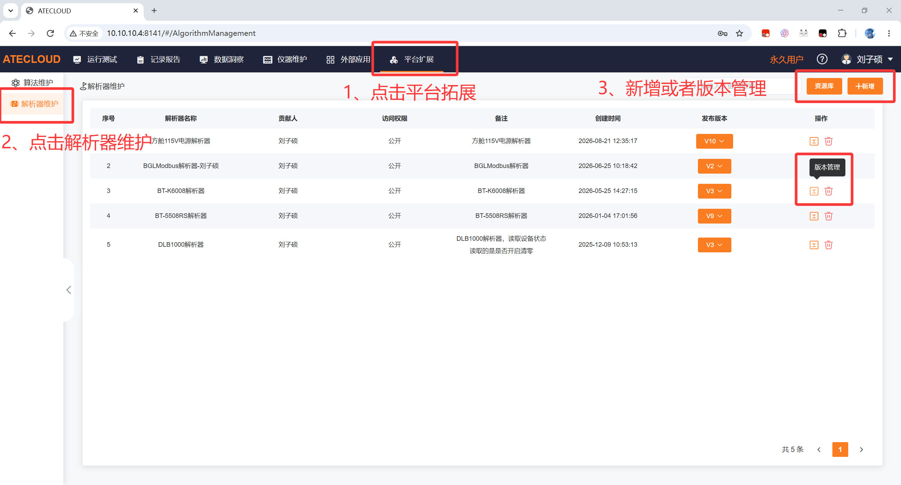

【图片79:解析器界面】

### 8.1.1、解析器基本信息

编写解析器时，需要注意以下事项：

1. 填写解析器名称，**名称不能重复**；
2. 添加解析器备注，说明这个解析器是给什么设备用的；
3. **入口函数的代码不要动**，保持模板原样；
4. **需要修改的是入口函数的名称**，而且名称必须全系统唯一，否则会报错。

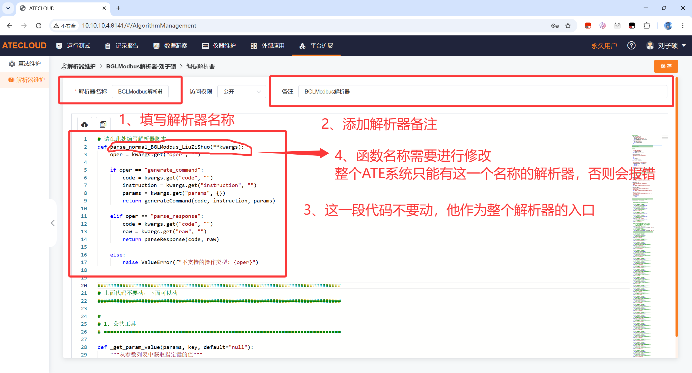

【图片80:解析器算法界面1】

### 8.1.2、命令解析函数（设置命令）

`def generateCommand(code, instruction, params)` 是命令解析函数（负责生成实际发送的命令），需要手动填写。

- `code`：需要判断的值。当 `code` 与提前设置好的指令编码相等时，执行对应逻辑；
- `return` 出去的内容：才是实际发送给设备的命令。

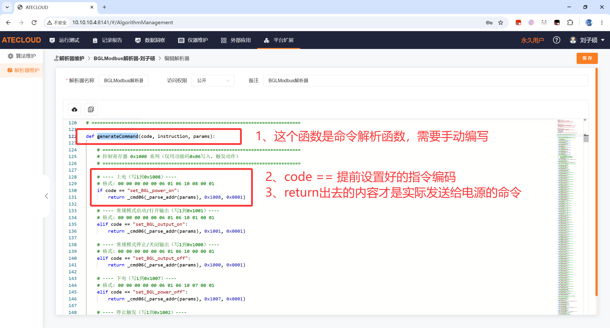

【图片81:解析器算法界面2】

### 8.1.3、返回解析函数（查询命令）

查询（读取）命令同理。`def parseResponse(code, raw)` 是返回内容的解析函数。

- `code`：指令编码；
- `raw`：设备返回的参数内容，也就是实际返回值；
- 将 `raw` 解析后，`return` 出去的内容会直接赋值给测试指标。

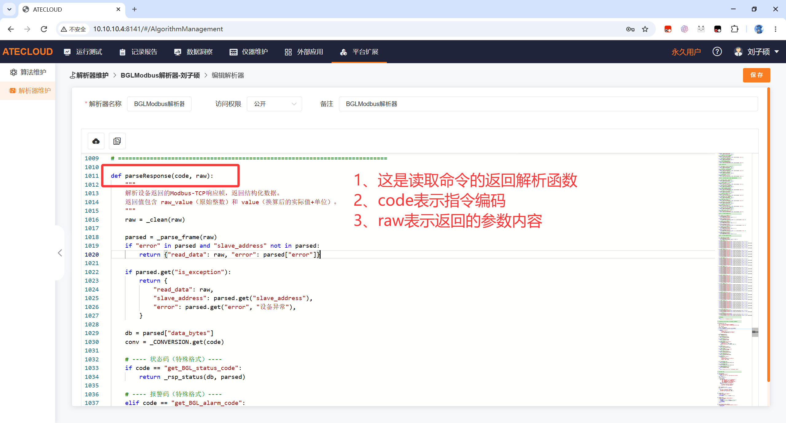

【图片82:解析器算法界面3】

## 8.2、解析器调试

解析器写好后，需要先把它绑定到对应的仪器型号上，再验证解析是否正常。

### 8.2.1、把解析器绑定到仪器型号

1. 点击“仪器维护”；
2. 点击“仪器型号”；
3. 选择要添加解析器的型号；
4. 点击“编辑”；
5. 在“解析器”一栏中选择要使用的解析器。

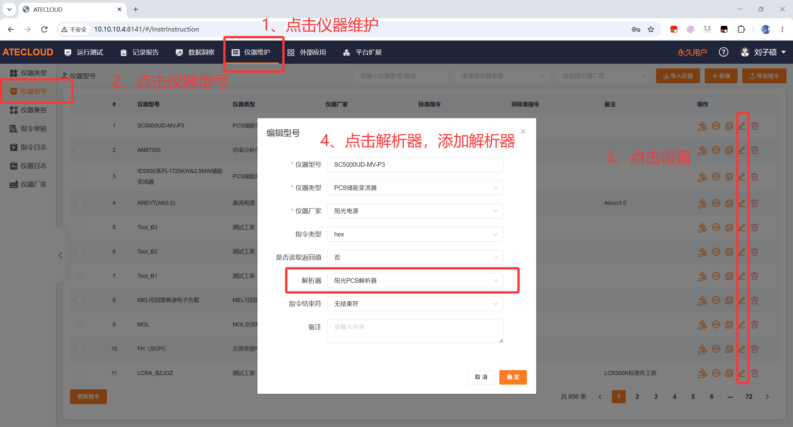

【图片83:解析器添加到设备】

### 8.2.2、添加设备并验证解析

1. 在“工位配置”页面添加这台设备；
2. 回到“仪器维护”界面，找到要测试的命令；
3. 点击“验证”，手动发送一次；
4. 查看日志，确认解析是否成功。

如果解析成功，说明解析器已经正常工作。

如果解析失败，可以按下面的顺序排查：

1. 检查硬件连接；
2. 检查软件连接；
3. 检查解析器是否漏加了这条命令的解析；
4. 如果仍无法解决，记录失败原因，反馈给刘子硕或其他熟悉解析器的工程师。

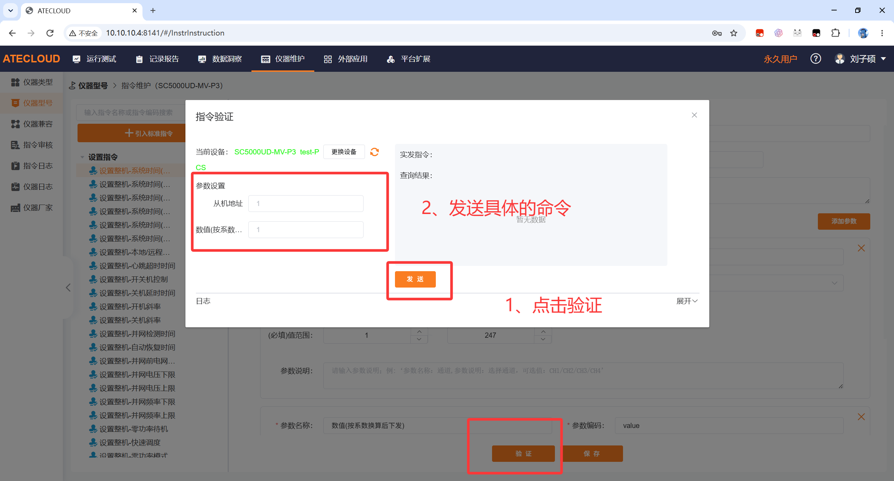

【图片84:解析器调试】

## 8.3、算法维护

ATE 系统自带的算法虽然很方便，但很多测试操作仍然无法通过自带算法完成，这时就需要使用自制算法。ATE 系统提供了算法接口，在“算法维护”中编写 Python 脚本，即可创建并使用自定义算法。

### 8.3.1、算法创建

**进入路径**：

1. 点击“平台拓展”；
2. 点击“算法维护”；
3. 点击“新建”创建算法；如需修改已有算法，在“操作”一栏中进入编辑。

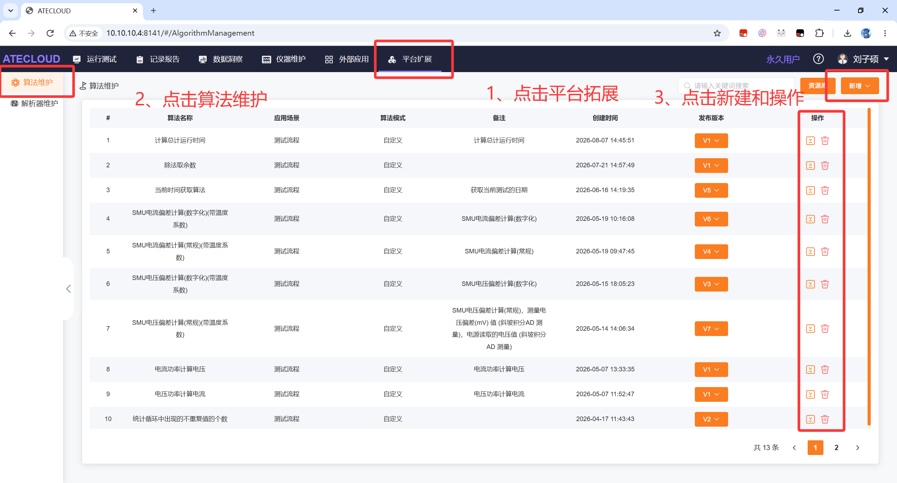

【图片85:算法创建页面】

创建或打开算法后，进入算法编写页面：

1. 填写算法名称、应用场景；
2. 填写输入参数和返回数据；
3. 在主页面编写 Python 算法。

**注意事项**：

1. 算法名称必须**全系统唯一**；
2. 输出数据必须是一个名为 `result` 的变量，并且 `result` 中要包含所有返回数据元素；
3. 输入数据要与传入参数保持一致。

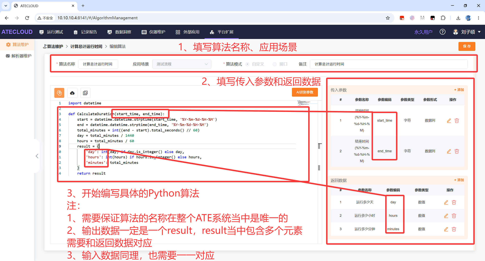

【图片86:算法编写界面】

### 8.3.2、算法使用

算法编写并调试完成后，按下面的步骤使用：

1. 发布算法；
2. 进入项目编辑页面，在“算法”栏找到刚编写的算法；
3. 将算法拖入画布，保存项目。

> **首次使用提示**：第一次运行这个项目时，ATEBOX 工位会自动添加对应的算法；但由于添加算法时方案已经在运行，第一次可能返回空数据，**重新运行一遍即可**。

## 8.4、本章小结

- **解析器**：用于非 SCPI 协议设备，负责“参数 → 实际命令”和“原始返回 → 测试指标”的转换；制作后要绑定到仪器型号并验证；
- **算法**：用于自带算法无法覆盖的场景，在“算法维护”中编写 Python 脚本；注意名称全系统唯一、输出变量为 `result`；发布后才能在项目中拖入使用；
- **排查思路**：解析或算法调试失败时，先检查硬件、软件连接和配置，再反馈给熟悉系统的工程师。


# 九、其他注意事项

## 9.1、项目当中小技巧

> 内容待补充。

## 9.2、项目开展前的测试执行方案模板

> 内容待补充。

# 更新维护日志

> 2026/9/11 V2.0.0版——刘子硕
